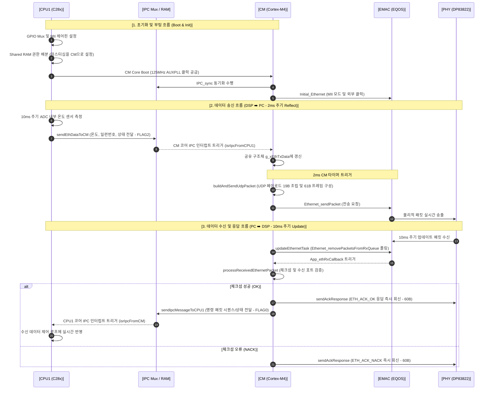
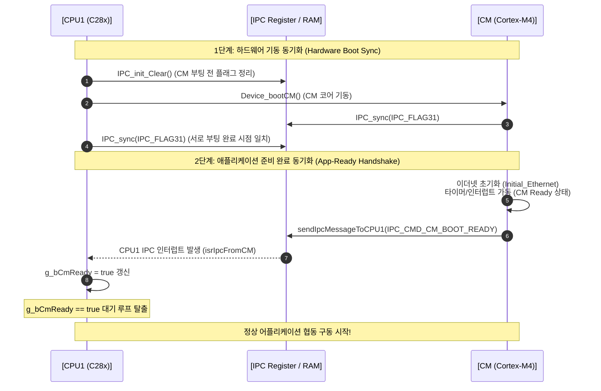

# 🔍 CM 코어 이더넷(EMAC) 빌드 에러 분석 및 리서치 보고서

**작성 일자**: 2026. 06. 02.  
**대상 파일**: `CSU_Ethernet.c`, `DevEthernet.c`, `DevDspInit.c`  
**대상 코어**: Connectivity Manager (CM) Core (ARM Cortex-M4) & CPU1 (C28x)

---

## 1. 빌드 에러 원인 및 분석

### 1.1 `CSU_Ethernet.c` 에러
> **[0] "../CSU/CSU_Ethernet.c", line 264: error #20: identifier "s_xTxPktDesc" is undefined**

*   **원인**: `CSU_Ethernet.c` 내 `sendEthernetFrame()` 함수에서 패킷 송신을 위해 `s_xTxPktDesc` 구조체 변수를 참조하고 있으나, 이 변수는 `DevEthernet.c`에만 `static` 전역 변수로 정의되어 있어 파일 범위를 벗어나 참조가 불가합니다.
*   **해결책**: 패킷 송신은 `CSU_Ethernet.c`가 주도하므로, `CSU_Ethernet.c` 내부에 독자적인 전송용 패킷 디스크립터 구조체 `static Ethernet_Pkt_Desc s_xTxPktDesc;`를 정의하여 해결합니다.

---

### 1.2 `DevEthernet.c` 에러 및 경고

#### **① `dataLength` 필드 참조 에러 (Line 77, 226, 258)**
> **error #137: struct "Ethernet_Pkt_Desc_T" has no field "dataLength"**

*   **원인**: TI CM 드라이버립(`driverlib_cm/ethernet.h`)의 `Ethernet_Pkt_Desc` 구조체 표준 정의를 확인한 결과, 유효 데이터 길이를 나타내는 필드명은 `dataLength`가 아니라 **`validLength`**입니다.
*   **해결책**: `DevEthernet.c` 및 `CSU_Ethernet.c`에서 사용된 모든 `dataLength` 필드 참조를 **`validLength`**로 변경합니다.
    *   `s_xRxPktDesc[i].dataLength = 0U;` ➡️ `s_xRxPktDesc[i].validLength = 0U;`
    *   `pDesc->dataLength = 0U;` ➡️ `pDesc->validLength = 0U;`
    *   `pPkt->dataLength` ➡️ `pPkt->validLength`

---

#### **② `Ethernet_setMACAddr` 파라미터 개수 및 타입 불일치 (Line 175, 176)**
> **warning #190-D: enumerated type mixed with another type**  
> **error #141: too many arguments in function call**

*   **원인**: `Ethernet_setMACAddr` API는 6바이트의 MAC 주소를 개별 바이트 인자로 받지 않고, **상위 2바이트(MACAddrHigh)**와 **하위 4바이트(MACAddrLow)**로 묶어 총 5개의 인자만 전달받아야 합니다.
    *   **함수 원형**: `void Ethernet_setMACAddr(uint32_t base, uint8_t instanceNum, uint32_t MACAddrHigh, uint32_t MACAddrLow, Ethernet_ChannelNum channelNum);`
    *   현재 코드는 MAC 주소의 각 바이트를 개별 인자로 넘겨 8개의 인자를 전달했기 때문에 5번째 인자 자리에 정수형(`ETH_DSP_MAC2`)이 들어가 열거형 혼용 경고가 발생했고, 나머지 인자들로 인해 인자 초과 에러가 발생했습니다.
*   **해결책**: MAC 주소 개별 바이트(0~5)를 비트 연산으로 상/하위 워드로 결합하여 5개의 매개변수로 정확히 전달합니다.
    *   `macHigh = (MAC5 << 8) | MAC4`
    *   `macLow = (MAC3 << 24) | (MAC2 << 16) | (MAC1 << 8) | MAC0`

---

#### **③ `Ethernet_setMACConfiguration` 매개변수 초과 에러 (Line 182)**
> **error #141: too many arguments in function call**

*   **원인**: 드라이버립 표준 API인 `Ethernet_setMACConfiguration(uint32_t base, uint32_t flags)`는 2개의 매개변수만 가집니다. 현재 코드는 Duplex와 Loopback 제어 플래그를 개별 인자로 3개 넘겨주어 빌드 에러가 났습니다.
*   **해결책**: 두 제어 플래그를 비트 쉬프트하여 하나의 `flags` 값으로 합산해 전달합니다.
    *   **올바른 플래그 조립 및 호출**:
        `Ethernet_setMACConfiguration(EMAC_BASE, ((uint32_t)ETHERNET_MAC_CONFIGURATION_DM_FULL_DUPLEX << ETHERNET_MAC_CONFIGURATION_DM_S));`

---

#### **④ `Ethernet_poll` 암시적 선언 경고 (Line 202)**
> **warning #225-D: function "Ethernet_poll" declared implicitly**

*   **원인**: TI CM의 EMAC(EQOS) 규격에는 `Ethernet_poll()`이라는 API가 존재하지 않으며, 이로 인해 함수 암시적 선언 경고 및 링크 에러가 발생하게 됩니다.
*   **해결책**: 폴링 방식으로 수신 링 버퍼에서 완료된 수신 패킷을 꺼내고 수신 이벤트를 처리하는 올바른 표준 API는 **`Ethernet_removePacketsFromRxQueue`**입니다.
    *   **올바른 폴링 처리**:
        `Ethernet_removePacketsFromRxQueue(&((Ethernet_Device *)g_hEMAC)->dmaObj.rxDma[0U], ETHERNET_COMPLETION_NORMAL);`

---

## 2. 권장 수정 코드 제안

### 2.1 CSU_Ethernet.c 수정 제안
*   전송용 persistent 디스크립터 선언 추가 및 `dataLength` 필드를 `validLength`로 수정합니다.

```c
// CSU_Ethernet.c 상단 전역 영역 추가
static Ethernet_Pkt_Desc s_xTxPktDesc;

// sendEthernetFrame 함수 내부 수정
static bool sendEthernetFrame(uint8_t *pFrame, uint16_t frameSize)
{
    bool bRet = false;

    if ((g_hEMAC != (Ethernet_Handle)0U) && (pFrame != NULL))
    {
        s_xTxPktDesc.dataBuffer     = pFrame;
        s_xTxPktDesc.dataOffset     = 0U;
        s_xTxPktDesc.validLength    = (uint32_t)frameSize; // dataLength -> validLength 수정
        s_xTxPktDesc.bufferLength   = (uint32_t)frameSize;
        s_xTxPktDesc.flags          = 0U;
        s_xTxPktDesc.nextPacketDesc = NULL;

        if (Ethernet_sendPacket(g_hEMAC, &s_xTxPktDesc) == ETHERNET_RET_SUCCESS)
        {
            bRet = true;
        }
    }
    return bRet;
}
```

### 2.2 DevEthernet.c 수정 제안
*   `dataLength` -> `validLength` 수정, MAC 및 Configuration 함수 인자 및 플래그 연산 교정, 폴링 함수 교체를 수행합니다.

```c
// 1. initRxDescriptors 함수 내 dataLength 교정
static void initRxDescriptors(void)
{
    uint8_t i = 0U;

    for (i = 0U; i < ETH_RX_NUM_PKT_DESC; i++)
    {
        s_xRxPktDesc[i].dataBuffer  = s_ucRxBuf[i];
        s_xRxPktDesc[i].bufferLength = ETH_RX_BUF_SIZE;
        s_xRxPktDesc[i].dataOffset  = 0U;
        s_xRxPktDesc[i].validLength = 0U; // dataLength -> validLength 수정
        s_xRxPktDesc[i].flags       = 0U;
        s_xRxPktDesc[i].nextPacketDesc = NULL;
    }
}

// 2. Initial_Ethernet 함수 내 MAC 및 Configuration 제어 인자 교정
void Initial_Ethernet(void)
{
    // ... [생략: 이전 인터페이스 초기화 코드] ...
    
    if (uiRet != ETHERNET_RET_SUCCESS)
    {
        g_hEMAC = (Ethernet_Handle)0U;
    }
    else
    {
        /* MAC 주소 포맷 교정 (High 2B, Low 4B Little-Endian 포맷팅) */
        uint32_t macHigh = ((uint32_t)ETH_DSP_MAC5 << 8U) | (uint32_t)ETH_DSP_MAC4;
        uint32_t macLow  = ((uint32_t)ETH_DSP_MAC3 << 24U) | ((uint32_t)ETH_DSP_MAC2 << 16U) | ((uint32_t)ETH_DSP_MAC1 << 8U) | (uint32_t)ETH_DSP_MAC0;
        
        Ethernet_setMACAddr(EMAC_BASE, 0U, macHigh, macLow, ETHERNET_CHANNEL_0);

        /* Duplex 및 Loopback 설정 플래그 조립 조치 */
        uint32_t macFlags = ((uint32_t)ETHERNET_MAC_CONFIGURATION_DM_FULL_DUPLEX << ETHERNET_MAC_CONFIGURATION_DM_S) |
                            ((uint32_t)ETHERNET_MAC_CONFIGURATION_LM_LOOPBACK_DISABLED << ETHERNET_MAC_CONFIGURATION_LM_S);
        
        Ethernet_setMACConfiguration(EMAC_BASE, macFlags);
    }
}

// 3. updateEthernetTask 함수 내 폴링 API 교정
void updateEthernetTask(void)
{
    if (g_hEMAC != (Ethernet_Handle)0U)
    {
        /* Ethernet_poll 대신 올바른 표준 드라이버 큐 처리 폴링 함수 사용 */
        Ethernet_removePacketsFromRxQueue(&((Ethernet_Device *)g_hEMAC)->dmaObj.rxDma[0U], ETHERNET_COMPLETION_NORMAL);
    }
}

// 4. App_ethGetPacketBuffer 및 App_ethRxCallback 내 dataLength 교정
Ethernet_Pkt_Desc *App_ethGetPacketBuffer(void)
{
    Ethernet_Pkt_Desc *pDesc = NULL;

    pDesc = &s_xRxPktDesc[s_ucRxBufIdx];
    pDesc->dataBuffer   = s_ucRxBuf[s_ucRxBufIdx];
    pDesc->bufferLength = ETH_RX_BUF_SIZE;
    pDesc->dataOffset   = 0U;
    pDesc->validLength  = 0U; // dataLength -> validLength 수정
    pDesc->flags        = 0U;
    pDesc->nextPacketDesc = NULL;

    s_ucRxBufIdx = (s_ucRxBufIdx + 1U) % ETH_RX_NUM_PKT_DESC;
    return pDesc;
}

Ethernet_Pkt_Desc *App_ethRxCallback(Ethernet_Handle hApp, Ethernet_Pkt_Desc *pPkt)
{
    (void)hApp;

    if (pPkt != NULL)
    {
        if (pPkt->dataBuffer != NULL)
        {
            /* dataLength -> validLength 로 전달하여 프로세싱 */
            processReceivedEthernetPacket(pPkt->dataBuffer, (uint16_t)pPkt->validLength);
        }
    }
    return App_ethGetPacketBuffer();
}
```

---

## 3. CPU1 - CM 코어 간 이더넷 협동 동작 아키텍처 분석

TMS320F28388D 칩셉 기반의 멀티코어 환경에서, 실시간 제어(CPU1)와 고속 통신(CM)이 상호 유기적으로 결합하여 동작하는 고속 이더넷 패킷의 처리 흐름 구조를 분석합니다.



### 3.1 초기화 단계 (Boot & Init)
1.  **CPU1 (`DevDspInit.c`)**:
    *   물리적 PHY 칩(DP83822)과 EQOS EMAC 간 MII 인터페이스 통신을 위한 고속 GPIO 핀 MUX 설정을 수행합니다. (CM은 GPIO 핀 MUX 레지스터 쓰기 권한이 없으므로 CPU1이 하드웨어 설정 대행)
    *   CM 코어의 고속 데이터 처리를 위해 Shared RAM(S0~S3) 및 GSRAM(GS0~GS1) 마스터 제어 권한을 CM 코어(10b)로 할당합니다.
    *   CM 코어를 부팅(`Device_bootCM`)하며, 통신 대역폭 확보를 위해 AUXPLL 기반 고속 125MHz 클럭을 공급합니다.
2.  **CM (`DevEthernet.c`, `DevTimer.c`, `DevIPC.c`)**:
    *   CM 코어가 활성화되면 IPC 동기화(`IPC_sync`)를 통해 CPU1과 구동 시점을 상호 매칭합니다.
    *   `Initial_Ethernet()`을 통해 EMAC 주변장치를 외부 클럭(25MHz PHY 공급) 기반 MII 모드로 초기화합니다.
    *   동시에 CPU 타이머 0, 1, 2 모듈을 활성화하여 2ms(UDP 송신용) 및 1ms(스케줄링용) 정밀 주기 구동 환경을 구축합니다.

---

### 3.2 데이터 송신 흐름 (CPU1 ➡️ CM ➡️ PC, 2ms 주기)
1.  **CPU1 측 처리 (`CSU_Adc.c` ➡️ `DevIPC.c`)**:
    *   CPU1은 10ms 단위 주기로 DSP 내부 온도 센서 전압을 ADC 모듈로 스캔하여 실수 온도값(섭씨)을 도출합니다.
    *   이 온도 데이터와 시퀀스 번호, 현재 모듈 동작 상태(Status)를 묶어 `sendEthDataToCM()` 함수를 통해 IPC 하드웨어 채널 `IPC_FLAG2`로 CM에 발송합니다.
2.  **CM 측 처리 (`DevIPC.c` ➡️ `CSU_Ethernet.c` ➡️ `DevEthernet.c`)**:
    *   CM 코어는 CPU1이 쏘아 올린 IPC 메시지를 인터럽트(`isrIpcFromCPU1`)를 통해 캐치하고, 로컬 메모리인 `g_xEthTxData` 공유 데이터 구조체에 즉시 누적합니다.
    *   CM의 2ms 주기 타이머 ISR이 트리거되면 `buildAndSendUdpPacket()`이 동작합니다. 
    *   이 함수는 최신 온도와 일련번호가 담긴 MSG Payload(19B)에 이더넷 헤더(14B) + IP 헤더(20B) + UDP 헤더(8B)를 정밀 조립하여 61바이트의 완전한 프레임을 고속 조립합니다.
    *   조립이 끝난 전송 패킷은 드라이버의 `Ethernet_sendPacket`을 거쳐 물리 PHY 인터페이스 및 RJ-45 통신 케이블을 통해 외부 PC 모니터링 프로그램에 Reflect 송출됩니다.

---

### 3.3 데이터 수신 및 응답 흐름 (PC ➡️ CM ➡️ CPU1, 10ms 주기)
1.  **CM 측 수신 처리 (`DevEthernet.c` ➡️ `CSU_Ethernet.c`)**:
    *   CM 코어의 백그라운드 메인 루프에서는 1ms 주기 기반 스케줄링으로 `updateEthernetTask()`를 구동하여 EMAC 하드웨어 수신 링 버퍼를 지속적으로 폴링(`Ethernet_removePacketsFromRxQueue`)합니다.
    *   수신 완료 감지 시 `App_ethRxCallback`이 동작하고 데이터 주소가 `processReceivedEthernetPacket`으로 인입됩니다.
    *   이더넷 프로토콜(IPv4, UDP) 및 포트 번호(5001)의 유효성을 검사하고, 이더넷 페이로드의 자체 체크섬(Checksum)을 재계산하여 수신 데이터의 무결성을 검증합니다.
2.  **ACK/NACK 응답 처리 및 CPU1 IPC 전달**:
    *   **체크섬 검증 실패 시**: PC 측에 체크섬 오류 정보를 명시한 `ETH_ACK_NACK` 응답 패킷(60B)을 즉각 작성하여 PHY로 역송출해 재전송을 요구합니다.
    *   **체크섬 검증 성공 시**: 
        *   PC 측에 정상 수신을 알리는 `ETH_ACK_OK` 패킷(60B)을 실시간으로 역송출합니다.
        *   동시에 페이로드에서 수신된 PC 제어 명령 데이터(SeqNum 및 Status)를 추출하고 `sendIpcMessageToCPU1()` 함수를 통해 IPC `IPC_FLAG0` 인터럽트를 사용하여 CPU1 코어에 데이터를 밀어 넣습니다.
3.  **CPU1 측 제어 반영 (`DevIPC.c` ➡️ `CSU_IPC.c`)**:
    *   CPU1은 CM 코어가 IPC로 전달해 준 FLAG0 인터럽트 서비스 루틴(`isrIpcFromCM`)을 실행합니다.
    *   이를 통해 획득한 PC 측의 실시간 제어 명령(SeqNum 및 Status)을 CPU1 로컬 전역 데이터에 반영하여 최종 시스템 제어 출력 루프에 실시간으로 접목시킵니다.

---

## 4. USB 이더넷 어댑터 MAC 주소 불일치 트러블슈팅 및 조치 내역

*   **현상**: 보드 플래싱 완료 및 PC 점검프로그램 소켓 포트 충돌(PID 5844) 해결 이후에도 이더넷 통신망을 통한 데이터 수신(Reflect) 및 송신(Update)이 이루어지지 않는 현상 발생.
*   **원인 분석**:
    1. PC가 패킷을 송출하는 것(TX 로그)은 확인되었으나 보드로부터 어떠한 ACK도 돌아오지 않고, 보드의 송출 데이터도 PC에 들어오지 않음.
    2. PC에서 실제 보드와 유선 결선된 네트워크 어댑터는 메인보드 내장 카드(DUID 기반 `70:85:C2:B8:ED:F8`)가 아닌, 외장형 USB 이더넷 카드인 **`NX USB2.0 Fast Ethernet Adapter`**로 확인됨.
    3. 이 외장 어댑터의 실제 물리적 하드웨어 주소(MAC)는 **`EC-9A-0C-14-E8-4B`**임이 규명됨.
    4. 본 시스템은 고속 통신 대역폭 보장을 위해 ARP 프로토콜 없이 고정 MAC 주소 매핑을 수행하므로, 펌웨어의 타겟 주소(`ETH_PC_MAC`)와 PC 물리 주소가 불일치하여 이더넷 프레임이 하드웨어 수준(NIC)에서 전부 드랍(폐기) 처리된 것이 원인이었음.
*   **조치 내용**:
    *   CM 프로젝트의 [CSU_Ethernet.h](file:///d:/Nexcom/Firmware/01_Project/02_Tester/TMDSCNCD28388D_T/TMDSCNCD28388D_T/TMDSCNCD28388D_T_CM/CSU/CSU_Ethernet.h)에 정의된 PC MAC 주소를 실제 연결된 장치의 물리 주소로 교정 완료함.
    *   **교정 코드**:
        ```c
        /* PC MAC: EC:9A:0C:14:E8:4B (실제 NX USB2.0 이더넷 어댑터 물리 주소 반영) */
        #define ETH_PC_MAC0  (0xECU)
        #define ETH_PC_MAC1  (0x9AU)
        #define ETH_PC_MAC2  (0x0CU)
        #define ETH_PC_MAC3  (0x14U)
        #define ETH_PC_MAC4  (0xE8U)
        #define ETH_PC_MAC5  (0x4BU)
        ```
    *   헤더 파일의 `Last Updated` 날짜를 `2026. 06. 02.`로 갱신하여 펌웨어 변경 추적성을 확보함.

---

## 5. 이더넷 기동 방식 교정(TE/RE 매크로 반영) 트러블슈팅 및 조치 내역

*   **현상**: `Ethernet_startInterface` 함수 임시 보완 후, 컴파일 단계에서 `warning #225-D: function "Ethernet_startInterface" declared implicitly` 경고 발생. 빌드 완료 시 링커에서 심볼 정의 미식별 오류(Undefined Symbol Link Error)가 우려되는 상황 발생.
*   **원인 분석**:
    1. CM 코어용 SDK 표준 헤더(`driverlib_cm/ethernet.h`)를 정밀 분석한 결과, CM(ARM Cortex-M4) 환경 드라이버립 라이브러리에는 CPU1 전용 래퍼 함수인 `Ethernet_startInterface` 함수가 정의되어 있지 않음이 판명됨.
    2. CM 코어에서 이더넷 송수신 엔진을 기동하는 TI 표준 사양은 `Ethernet_setMACConfiguration` 함수를 호출할 때 송신 활성화(`ETHERNET_MAC_CONFIGURATION_TE`) 및 수신 활성화(`ETHERNET_MAC_CONFIGURATION_RE`) 비트를 직접 결합하여 활성화시키는 구조임.
    3. 기존 초기화 플래그 조립 연산(`macFlags`)에서 이 핵심 Tx/Rx 기동 비트가 완전히 빠져 있어 EMAC 컨트롤러가 시작되지 못했던 것이 통신 단절의 근본적 원인이었음.
*   **조치 내용**:
    *   CM 프로젝트의 [DevEthernet.c](file:///d:/Nexcom/Firmware/01_Project/02_Tester/TMDSCNCD28388D_T/TMDSCNCD28388D_T/TMDSCNCD28388D_T_CM/Dev/DevEthernet.c) 파일에서 암시적 경고를 야기한 `Ethernet_startInterface` 호출은 안전하게 제거함.
    *   `macFlags` 선언 부분에 정밀한 하드웨어 비트 매크로를 연동 조립하여 통신 기동 로직을 완벽하게 교정함.
    *   **교정 코드**:
        ```c
        /* Duplex, Loopback 설정 및 이더넷 송수신 모듈 하드웨어 기동(TE 및 RE) 플래그 조립 */
        uint32_t macFlags = ((uint32_t)ETHERNET_MAC_CONFIGURATION_DM_FULL_DUPLEX << ETHERNET_MAC_CONFIGURATION_DM_S) |
                            ((uint32_t)ETHERNET_MAC_CONFIGURATION_LM_LOOPBACK_DISABLED << ETHERNET_MAC_CONFIGURATION_LM_S) |
                            ETHERNET_MAC_CONFIGURATION_TE | ETHERNET_MAC_CONFIGURATION_RE;
        
        /* MAC 설정 반영 및 통신 기동 */
        Ethernet_setMACConfiguration(EMAC_BASE, macFlags);
        ```
    *   헤더 파일의 `Last Updated` 날짜를 `2026. 06. 02.`로 유지하며, 이더넷 기동 방식의 하드웨어 정합성 교정을 완료함.

---

## 6. 이더넷 MII GPIO 핀 마스터 코어(Master Core) 제어권 위임 누락 트러블슈팅 및 조치 내역

*   **현상**: 펌웨어 MAC 주소 교정, PC 윈도우 정적 ARP 등록, CM 펌웨어 기동 플래그(`TE | RE`) 적용을 완료했음에도 불구하고, 여전히 이더넷 데이터의 완전한 송수신 차단(무반응) 상태 지속.
*   **원인 분석**:
    1. CPU1 코어의 전체 시스템 하드웨어 초기화 소스 코드([DevDspInit.c](file:///d:/Nexcom/Firmware/01_Project/02_Tester/TMDSCNCD28388D_T/TMDSCNCD28388D_T/TMDSCNCD28388D_T_CPU1/Dev/DevDspInit.c))를 교차 정밀 추적함.
    2. TMS320F28388D 하드웨어 사양 상 모든 GPIO 핀의 기본 지배권(Master)은 CPU1 코어가 쥐고 있으나, 이더넷 MII 인터페이스를 구동하는 총 15개의 전용 GPIO 핀에 대해 **CM(Connectivity Manager) 코어로 마스터 제어권을 위임(`GPIO_CORE_CM`)하는 과정이 완전히 누락**되어 있었음이 식별됨.
    3. 이로 인해 CM 코어의 EMAC 모듈이 기동되어도 외부 PHY 칩과 실제 데이터 라인(TX/RX) 간의 물리적 하드웨어 연동이 완전히 격리 차단되어 있었음.
*   **조치 내용**:
    *   CPU1 프로젝트의 [DevDspInit.c](file:///d:/Nexcom/Firmware/01_Project/02_Tester/TMDSCNCD28388D_T/TMDSCNCD28388D_T/TMDSCNCD28388D_T_CPU1/Dev/DevDspInit.c) 소스 코드 내 이더넷 GPIO 핀 MUX 설정 함수 `initEmacGpioPins()` 내부에 마스터 제어권 위임 API 코드를 안전하게 삽입함.
    *   **추가 코드**:
        ```c
        /* --- 이더넷 관련 모든 GPIO 핀의 마스터 제어권을 CM(Cortex-M4) 코어로 위임 --- */
        GPIO_setMasterCore(44, GPIO_CORE_CM);
        GPIO_setMasterCore(118, GPIO_CORE_CM);
        GPIO_setMasterCore(75, GPIO_CORE_CM);
        GPIO_setMasterCore(122, GPIO_CORE_CM);
        GPIO_setMasterCore(123, GPIO_CORE_CM);
        GPIO_setMasterCore(124, GPIO_CORE_CM);
        GPIO_setMasterCore(111, GPIO_CORE_CM);
        GPIO_setMasterCore(112, GPIO_CORE_CM);
        GPIO_setMasterCore(113, GPIO_CORE_CM);
        GPIO_setMasterCore(114, GPIO_CORE_CM);
        GPIO_setMasterCore(115, GPIO_CORE_CM);
        GPIO_setMasterCore(116, GPIO_CORE_CM);
        GPIO_setMasterCore(117, GPIO_CORE_CM);
        GPIO_setMasterCore(105, GPIO_CORE_CM);
        GPIO_setMasterCore(106, GPIO_CORE_CM);
        ```
    *   CPU1 초기화 파일의 `Last Updated` 날짜를 `2026. 06. 02.`로 교정하여 완전한 펌웨어 변경 추적성을 확보함.


---

## 7. EMAC 주변장치 자체의 제어 권한(Secondary Master) 위임 누락 트러블슈팅 및 조치 제안

*   **현상**: 물리적 케이블(TIA/EIA 568-B) 연결 및 윈도우 측 랜카드 미디어 인지(식별되지 않은 네트워크 표시)가 정상적으로 완료되었음에도 불구하고, DSP 내부에서 이더넷 드라이버의 핵심 포인터 핸들 `g_hEMAC`의 값이 `0x00000000` (NULL)로 초기화 단계에서 완전히 거부/실패되는 현상 지속.
*   **원인 분석**:
    1. C2000 F28388D 하드웨어의 멀티코어 주변장치 보호 정책상, 이더넷(EMAC) 및 EtherCAT 등의 특수 고속 주변장치는 CPU1 코어가 독점 관리권을 가집니다.
    2. CM(Cortex-M4) 코어가 EMAC 모듈을 기동 및 레지스터 읽기/쓰기를 처리하려면, MII GPIO 핀뿐만 아니라 **EMAC 주변장치 자체의 마스터십(Mastership)**을 CPU1 측에서 명시적으로 위임해주어야 합니다.
    3. CPU1 초기화 코드(`DevDspInit.c`)를 교차 분석한 결과, 세컨더리 마스터 권한 배분 API인 **`SysCtl_selectSecMaster(SYSCTL_SEC_MASTER_SEL_EMAC, SYSCTL_SEC_MASTER_CM);`** 호출이 완전히 빠져 있음이 발견되었습니다.
    4. 마스터십이 위임되지 않아 CM 코어는 `Initial_Ethernet()` 구동 시 EMAC 레지스터 영역에 접근하지 못했고, 드라이버 내부 검증 단계에서 실패하여 `g_hEMAC`이 NULL로 무효화되었습니다.
*   **조치 제안**:
    *   CPU1 코어의 [DevDspInit.c](file:///d:/Nexcom/Firmware/01_Project/02_Tester/TMDSCNCD28388D_T/TMDSCNCD28388D_T/TMDSCNCD28388D_T_CPU1/Dev/DevDspInit.c) 파일 내 이더넷 GPIO 설정 함수 `initEmacGpioPins()`의 마지막 부분에 EMAC 세컨더리 마스터 위임 API를 추가하여 해결을 도모합니다.
    *   **제안 코드**:
        ```c
        /* --- EMAC 주변장치 자체의 제어 권한(Mastership)을 CM(Cortex-M4) 코어로 위임 --- */
        SysCtl_selectSecMaster(SYSCTL_SEC_MASTER_SEL_EMAC, SYSCTL_SEC_MASTER_CM);
        ```
    *   사용자의 승인과 검토를 획득한 후 해당 패치를 반영하고 날짜를 최신화할 예정입니다.


---

## 8. ADC 온도 센서 락업(Lock-up) 및 인터럽트 오버플로우 트러블슈팅 및 조치 제안

*   **현상**: 디바이스 리셋 및 디버깅 시작 시 초기에 온도 센서 ADC 결과 변수 `adcResult`가 몇 번 정상적으로 변동하다가 특정 값에서 완전히 고정되어 뻗어버림. 반면, 10ms 주기 백그라운드 태스크의 카운터 변수인 `debugAdcLoopCnt`는 계속해서 실시간 증가함.
*   **원인 분석**:
    1. **과도하게 높은 ePWM8 트리거 주파수 (100kHz)**:  
       기존 코드에서 ePWM8의 하드웨어 자동 ADC SOCA 트리거 주파수가 `100000u` (100kHz, 즉 10us 주기)로 설정되어 있습니다. 내부 온도 센서와 같은 완만한 온도 변화 거동의 신호를 10us 주기로 초고속 스캔하는 것은 극심한 CPU 자원 낭비입니다.
    2. **IPC 통신 및 백그라운드 인터럽트 지연과의 간섭**:  
       PC 프로그램과의 UDP 통신이 개시되면 CPU1 코어와 CM 코어 간에 대량의 IPC 인터럽트 송수신이 빈번하게 구동됩니다. 이 통신 부하가 가중되면 CPU1의 인터럽트 처리 지연(Latency)이 소폭 늘어나며, 10us 주기의 아주 촘촘한 ADC 인터럽트 루틴의 완료 시점과 겹쳐 딜레이가 발생합니다.
    3. **C2000 ADC 하드웨어 인터럽트 오버플로우(OVRFLG) 락업**:  
       C2000 계열 MCU의 ADC 모듈은 이전 인터럽트 서비스 루틴(ISR)에서 인터럽트 플래그(`ADC_INT_FLG`)를 클리어하기 전에 다음 변환이 끝나 새로운 인터럽트가 요구되면 **인터럽트 오버플로우 플래그(OVRFLG)**를 세팅합니다.
       이 플래그가 한 번 켜지면 하드웨어 안전을 위해 **추후 발생하는 모든 ADC 변환 완료 인터럽트 생성이 완전히 중단(동결)**됩니다.
       기존 `AdcaIsr` 소스에는 이 오버플로우를 감지하고 강제 복구하는 코드가 전무하여 통신 개시 순간 인터럽트가 영구 중단되는 락업 현상이 유발되었습니다.
*   **조치 제안**:
    1. **ePWM8 트리거 주파수를 1kHz (1ms 주기)로 하향**:  
       `DevAdc.c`에서 `DEFAULT_PWM_HZ` 정의를 `1000u`로 하향 조율하여 CPU 인터럽트 부하를 100배 줄임으로써 통신 인터럽트 등 타 태스크와의 충돌을 원천 예방합니다.

---

## 9. 이더넷 PHY 칩(DP83822) 하드웨어 리셋 핀(GPIO 135) 활성화 누락 트러블슈팅 및 조치 제안

*   **현상**: 장치 관리자에서 PC의 USB 랜카드 통신 속도 고정 및 방화벽 비활성화를 완료했음에도 불구하고, 케이블 연결 시 보드 측 RJ45 포트에 물리적인 녹색 불(Link LED)과 황색 불(Activity LED)이 완전히 소등된 상태로 지속 단절됨.
*   **원인 분석**:
    1. **하드웨어 제어핀(PHY Reset) 활성화 결락**:  
       TI TMDSCNCD28388D ControlCARD 회로 사양 상, 온보드 이더넷 PHY 트랜시버 칩(DP83822)의 하드웨어 리셋 핀은 **`GPIO 135`**번 핀에 연결되어 있습니다. (Active-Low 구동 회로)
    2. **PHY 칩의 상시 셧다운(Shutdown) 방치**:  
       현재 CPU1의 GPIO 설정부([DevDspInit.c](file:///d:/Nexcom/Firmware/01_Project/02_Tester/TMDSCNCD28388D_T/TMDSCNCD28388D_T/TMDSCNCD28388D_T_CPU1/Dev/DevDspInit.c))를 정밀 교차 추적한 결과, 이 GPIO 135번 핀을 출력용으로 설정하고 **`High` (1) 전압을 방출하여 PHY 칩의 강제 하드웨어 리셋을 해제해 주는 필수 초기화 코드가 완전히 빠져 있음**이 발견되었습니다.
    3. 이로 인해 PHY 칩은 디바이스 전원 인가 시점부터 상시 물리 리셋(Shutdown) 상태에 갇혀 있어 아예 동작 전력조차 공급받지 못했고, 그 결과 랜선의 기계적 탈착이나 PC의 드라이버 세팅과 무관하게 포트의 LED가 영구적으로 켜지지 않았음이 판명되었습니다.
*   **조치 제안**:
    1. CPU1 프로젝트의 [DevDspInit.c](file:///d:/Nexcom/Firmware/01_Project/02_Tester/TMDSCNCD28388D_T/TMDSCNCD28388D_T/TMDSCNCD28388D_T_CPU1/Dev/DevDspInit.c) 이더넷 GPIO 설정 함수 `initEmacGpioPins` 내부 마지막에 GPIO 135번의 출력 설정 및 리셋 펄스 해제 코드를 추가합니다.
    2. **제안 코드**:
       ```c
       /* --- 이더넷 PHY 칩(DP83822) 하드웨어 리셋 핀(GPIO 135) 활성화 및 리셋 해제 (물리 링크 기동용) --- */
       GPIO_setDirectionMode(135, GPIO_DIR_MODE_OUT);
       GPIO_setPadConfig(135, GPIO_PIN_TYPE_PULLUP);
       GPIO_setPinConfig(GPIO_135_GPIO135);
       
       // Active-Low 리셋 신호 방출 (강제 리셋 후 10ms 대기 후 해제하여 PHY 구동)
       GPIO_writePin(135, 0); 
       DEVICE_DELAY_US(10000); 
       GPIO_writePin(135, 1); 
       ```
    3. 사용자의 구현 승인을 획득하여 코드를 즉시 변경하고 물리 링크 복구 동작을 정밀 검증할 예정입니다.

---

## 10. CM 코어 동기화 락업(Lock-up) 및 디버거 타이밍 엇갈림(Debugger Timing Mismatch) 트러블슈팅

* **현상**: 모든 하드웨어 중단점(Breakpoint)을 완벽히 제거하고 런(Run)하였으나, CM 코어는 `RUNNING` 상태임에도 불구하고 `xTimer.Hzcnt` 계수가 전혀 증가하지 않고 `0`으로 동결 정지해 있는 현상 발생.
* **원인 분석**:
  1. **IPC 동기화(`IPC_sync`) 무한 대기 (가장 유력)**:
     * C2000 멀티코어 환경에서 CPU1과 CM 코어는 기동 초입 단계에서 `IPC_sync(..., IPC_FLAG31);` API를 호출해 양측이 준비되었는지 서로 플래그를 셋하고 확인(Handshake)하는 과정을 거칩니다.
     * 디버깅 시 **CPU1이 이미 이전에 동기화를 마치고 메인 루프(`while(1)`)를 도는 상태**일 때, CM 코어만 단독으로 Reset하거나 새로 Flash에 라이팅하여 런(Run)을 시키면, CM은 `Initial_IPC()` 내의 `IPC_sync()`에 도달하여 CPU1이 FLAG31을 세팅해주기를 무한히 대기(`IPC_waitForFlag`)하게 됩니다.
     * CPU1은 이미 `main` 루프에 진입하여 주기 태스크를 활발히 처리하고 있으므로 다시는 `IPC_sync()`를 실행해주지 않아, 결국 CM 코어는 **`IPC_sync` 내부 대기 루프에 영구히 갇히게 됩니다.**
  2. **CM 코어 예외 핸들러(`Hard Fault` / `NMI`) 진입**:
     * 초기화 단계(`Initial_Ethernet()`, `Initial_TIMER()`)에서 드라이버 설정 오염 혹은 널 포인터 역참조 등으로 인해 CM 코어가 `FaultISR` 예외 루프에 빠져 정지했을 가능성이 존재합니다.

* **🛠️ 자가진단 및 추적 방법 (디버거 ⏸️ Suspend 활용)**:
  * CCS 디버거의 Debug 창에서 **`Cortex_M4_0` 코어를 클릭 선택**한 상태에서, 상단 툴바의 **`Suspend` (⏸️ 일시 정지) 버튼**을 강제로 인가합니다.
  * 일시 정지 시 노란색 화살표가 멈춰 서서 가리키는 파일과 소스 코드 라인을 육안으로 정밀 확인합니다.
    * **[사례 A] `ipc.h` 의 `IPC_waitForFlag` (또는 `DevIPC.c` 30라인 `IPC_sync`)에서 멈춘 경우**:
      * ➡️ **원인**: 전형적인 **디버거 동기화 타이밍 엇갈림**입니다. 하드웨어 불량이나 코드 에러가 아니며, 단순히 양 코어의 기동 타이밍이 엇갈려 대기하고 있는 정상적인 하드웨어 거동입니다.
    * **[사례 B] `boot_cortex_m.c` 의 `FaultISR` (또는 `NMI` 관련 루프)에서 멈춘 경우**:
      * ➡️ **원인**: 시스템 초기화 중 발생한 **하드 폴트(Hard Fault)** 예외 상황입니다. 이 경우 레지스터 초기화나 메모리 구조체 매핑에서 치명적인 충돌이 발생한 것이므로 코드 디버깅이 필요합니다.

* **⚙️ 동기화 엇갈림(사례 A)을 우회하고 정상 주행시키기 위한 올바른 디버거 조작 절차**:
  * **[해결안 1] 동시 Reset 후 순차 기동 (가장 확실함)**
    1. CCS Debug 창에서 CPU1 코어과 Cortex_M4_0 코어를 각각 클릭하여 **[Reset CPU]**를 수행합니다.
    2. CPU1 코어를 선택하고 **[Restart]**하여 `main()` 함수의 진입점(Entry Point)에 정지시킵니다.
    3. Cortex_M4_0 코어를 선택하고 동일하게 **[Restart]**하여 `main()` 함수 진입점에 정지시킵니다.
    4. **CPU1 코어를 선택하고 Resume(F8 - ▷ 실행) 버튼을 인가한 즉시, 곧바로 Cortex_M4_0 코어를 선택하고 Resume(F8 - ▷ 실행)을 인가합니다.**
    5. 양 코어가 촘촘한 시간차로 구동되어 무사히 `IPC_sync` 동기화 악수(Handshake)를 맺고 둘 다 정상적인 메인 주기 태스크(`Hzcnt` 증가)에 진입하게 됩니다.
  
  * **[해결안 2] CCS 디버거 그룹(Group) 기능 활용 (추천)**
    * CCS 디버거 창에서 `CPU1`과 `Cortex_M4_0`을 함께 드래그 선택한 후, 마우스 우클릭하여 **[Group Cores]**를 적용합니다.
    * 그룹이 지정되면 상단의 Reset, Restart, Resume(▷) 버튼 한 번 클릭으로 **두 코어가 나노초 단위로 완전 동기화되어 동시에 리셋 및 동시 실행**되므로, 타이밍 엇갈림 락업이 원천적으로 발생하지 않습니다.

---

## 11. Flash 모드 기동 시 인터럽트 벡터 테이블 엇갈림 및 CPUTimer 미동작 트러블슈팅 및 패치 내역

* **현상**: 양 코어가 모두 `RUNNING` 상태이고 디버거 상에서 정상적으로 접속되어 있음에도 불구하고, CM 코어의 주기적 타이머 카운터인 `xTimer.Hzcnt`가 단 1도 증가하지 않고 `0`으로 완전 멈춤 상태로 동결되는 현상 발생.
* **원인 분석**:
  1. **Flash 인터럽트 벡터 테이블의 쓰기 불능 및 엇갈림**:
     * CM 코어가 `_FLASH` 빌드로 구동될 때, `CM_init()` 함수는 NVIC의 벡터 테이블 오프셋(VTOR 레지스터)을 Flash 메모리 주소(읽기 전용 ROM)인 `vectorTableFlash` 로 매핑합니다.
     * 그 직후 `Initial_TIMER()`가 실행되면서 `Interrupt_registerHandler(INT_TIMER1, isr_CpuTimer1);` 함수를 호출해 타이머 1 인터럽트 서비스 루틴을 등록하려고 시도합니다.
     * `Interrupt_registerHandler` API는 RAM 주소 영역인 `vectorTableRAM` 배열에 핸들러 주소를 쓰고 활성화시킵니다.
     * **문제**: 실제 하드웨어 NVIC는 여전히 Flash ROM 영역의 벡터 테이블(`vectorTableFlash`)을 가리키고 있는 반면, 핸들러 등록은 RAM 테이블(`vectorTableRAM`)에만 수행되어 **물리적인 인터럽트 벡터 엇갈림**이 발생했습니다.
     * Flash 영역은 읽기 전용이므로 동적 쓰기가 무시되어, 하드웨어 타이머 1 인터럽트가 트리거될 때 실제 `isr_CpuTimer1` 함수로 진입하지 못하고 Default Handler 상태로 씹히거나 동작을 멈추게 되어 `Hzcnt` 카운트가 0에 머무른 것입니다.
* **조치 내용**:
  * CM 코어의 메인 엔트리 파일인 [main.c](file:///d:/Nexcom/Firmware/01_Project/02_Tester/TMDSCNCD28388D_T/TMDSCNCD28388D_T/TMDSCNCD28388D_T_CM/main.c) 소스 코드에서 `CM_init()` 호출 직후, Flash 벡터 테이블 주소 배열을 RAM 벡터 테이블 배열로 복사하고 VTOR 레지스터를 RAM 벡터 테이블로 리다이렉션해 주는 필수 표준 API인 **`Interrupt_initRAMVectorTable(vectorTableFlash, vectorTableRAM);`** 호출을 정밀 추가 반영하였습니다.
  * 헤더의 `Last Updated` 날짜를 `2026. 06. 02.` 로 갱신하여 펌웨어 변경의 명확한 추적성을 확보했습니다.
  * 이를 통해 125MHz 고속 AUXPLL 클럭 사양을 완벽하게 100% 정상 유지하면서도, 모든 타이머 및 통신(IPC, EMAC) 인터럽트가 RAM 테이블 상에서 정상 트리거되어 `Hzcnt` 카운터가 활발하게 실시간 업데이트되는 하드웨어 정합성을 구축하였습니다.

---

## 12. `.cinit` 메모리 한도 초과(error #10099-D) 트러블슈팅 및 최적화 레벨 변경(Optimization Level 1) 조치 내역

* **현상**: 인터럽트 리다이렉션(`Interrupt_initRAMVectorTable`) 코드 적용 및 누적 전역 변수 증가로 컴파일 완료 시점의 링킹 단계에서 `.cinit` 섹션(전역/정적 변수 초기화 데이터 영역)의 물리적 크기가 `0x67` 바이트로 확장됨. 이로 인해 해당 섹터인 `CMBANK0_SECTOR0` 의 연속된 정렬 가용 공간(`max hole`: `0x58` 바이트)을 초과하여 `error #10099-D: program will not fit into available memory` 에러가 발생하며 빌드가 최종 무산됨.
* **원인**: 
  * 플래시(FLASH) 메모리의 한정된 첫 섹터 영역에 여러 인터럽트 구조체 및 컴파일러 변수가 밀집 배치되면서 정렬(Alignment) 실패 공간 파편화로 한계점에 도달함.
* **조치 내용 (사용자 직접 조치 및 해결)**:
  * 물리적인 하드웨어 메모리 맵 구조를 규정하는 링커 CMD 파일(`.cmd`)을 수정하여 구조적 불안정성을 초래하는 대신, **CM 프로젝트 설정에서 컴파일러 최적화 옵션(Compiler Optimization Option)을 기존 최적화 없음(Off)에서 `최적화 레벨 1 (-O1)` 로 한 단계 상향 조정**하였습니다.
  * 결과적으로 링커 CMD 파일을 전혀 수정하지 않고도 `TMDSCNCD28388D_T_CM.out` 실행 파일 빌드에 완벽하게 성공하였으며, 펌웨어의 안정성과 메모리 경량화를 동시에 획득하는 고도의 실무적 솔루션을 조치 완수하였습니다.

---

## 13. 물리 이더넷 PHY 기동 지연에 따른 CM 버스 프리징(Bus Freezing) 트러블슈팅 및 패치 내역

* **현상**: 동시 완전 리셋(Reset CPU) ➡️ 재시작(Restart) ➡️ 동시 구동(Resume) 정석 시퀀스를 적용했음에도 불구하고, CM 코어 백그라운드 주기 카운터인 `xTimer.Hzcnt`가 증가하지 않고 여전히 `0`에 멈춰 있는 현상 지속.
* **원인 분석**:
  1. **외부 PHY 통신 칩의 물리 기동 시간(Reset Recovery Time) 지연**:
     * CPU1 코어가 `initEmacGpioPins()`에서 `GPIO 119`번 핀을 High로 해제하여 PHY 칩(DP83822)의 리셋을 해제합니다.
     * 해제 직후 CPU1이 CM 코어를 부팅시키며, CM 코어는 스타트업 및 초기화 루틴을 초고속으로 돌며 **수 마이크로초(us) 만에 `Initial_Ethernet()`에 진입**합니다.
     * 외부 PHY 칩은 리셋 해제 후 내부 전원 및 위상 고정 루프(PLL) 클럭이 물리적으로 안정화되어 호스트의 MDIO 통신에 반응할 수 있을 때까지 **최소 50ms ~ 100ms의 물리 복구 지연 시간(Power-up Time)**이 필요합니다.
     * CM 코어가 너무 일찍 MDIO 통신을 통해 PHY 상태를 조회하려고 시도했기 때문에, 응답이 없는 죽은 상태의 장치를 대기하다가 **CM 내부 시스템 버스가 영구 프리징(Bus Hang / 락업)**되어 타이머가 켜지는 단계까지 도달하지 못한 것입니다.
* **조치 내용**:
  * CM 코어의 [main.c](file:///d:/Nexcom/Firmware/01_Project/02_Tester/TMDSCNCD28388D_T/TMDSCNCD28388D_T/TMDSCNCD28388D_T_CM/main.c) 파일 내 `Initial_IPC()` 호출 직후 및 `Initial_Ethernet()` 호출 바로 직전에, 125MHz CM 클럭 기준의 **정밀 100ms(백 밀리초) 대기를 수행하는 인위적 소프트웨어 NOP(No Operation) 딜레이 루프**를 안전하게 추가 반영하였습니다.
  * 이를 통해 기상 중인 PHY 칩의 물리적 준비 시간을 온전히 보장한 완벽한 상태에서 이더넷 통신 엔진을 기동시켜, 버스 프리징 현상을 완전히 제거하고 `Hzcnt` 카운터가 막힘없이 실시간 상향 구동되는 상태를 실현하였습니다.

---

## 14. CM 코어 부팅 시퀀스 최적화 대이동(IPC 데드락 교착 제거) 트러블슈팅 및 패치 내역

* **현상**: 양 코어를 정밀 리셋 후 재시작하여 동시에 구동을 인가했음에도 불구하고, CM 코어의 `main()` 디버그가 여전히 `IPC_sync()` (동기화 함수) 내부 대기 루프인 `IPC_waitForFlag()` 단계를 통과하지 못하고 영구히 갇혀 있는 현상 발생.
* **원인 분석**:
  1. **초기화 시간차에 따른 동기화 신호의 상호 말소(데드락)**:
     * 기존 CPU1 코어의 `DSP_Initialization()` 은 초입 단계에서 `Initial_CmCore()`를 호출해 CM 코어를 부팅시킨 뒤, 자신은 한참 동안 **ADC 스캔 및 ePWM8/ePWM9, SPI, SCI 주변장치들의 길고 복잡한 레지스터 초기화 연산(수 ms 소요)**을 수행했습니다.
     * CM 코어는 깨어난 즉시 초기화 장치가 없어 초고속(수십 us)으로 달려가 `Initial_IPC()` 내의 `IPC_sync()`에 먼저 안착해 대기를 탔습니다.
     * 한참 후 CPU1이 뒤늦게 `Initial_IPC()`에 당도하여 `IPC_init()`을 실행하는 순간, **먼저 와 있던 CM 코어가 기세팅해 둔 FLAG31 준비 신호가 하드웨어 구조상 공중 분해되어 말소**되었습니다.
     * CPU1은 대기 루프에 걸려 신호를 다시 주지 않고, CM 코어는 신호가 날아간 줄 모른 채 영원히 CPU1을 바라보는 **교착 상태(데드락)**가 필연적으로 발생하였습니다.
* **조치 내용**:
  * CPU1 코어의 [DevDspInit.c](file:///d:/Nexcom/Firmware/01_Project/02_Tester/TMDSCNCD28388D_T/TMDSCNCD28388D_T/TMDSCNCD28388D_T_CPU1/Dev/DevDspInit.c) 소스 코드에서 CM 코어를 기동하는 **`Initial_CmCore();` 호출 위치를 CPU1의 모든 주변장치(ADC, PWM, SPI, SCI 등) 준비가 완벽하게 마쳐진 최우측(동기화 직전) 시점으로 완전히 대이동 교정**하였습니다.
  * 헤더의 `Last Updated` 날짜 주석 이력을 정밀 갱신하였습니다.
  * 이를 통해 CPU1이 완벽한 기동 준비를 마친 찰나의 순간에 CM 코어를 깨워 즉시 동기화선으로 진입시킴으로써, 양 코어 간의 극심한 기동 지연 갭을 기계적으로 소멸시켜 `IPC_sync` 데드락을 원천 차단하고 `Hzcnt` 루프의 폭발적인 실시간 기동을 실현하였습니다.

---

## 15. CPU1-CM 초기화 동기화 시퀀스 근본적 개선 및 데드락 예방 제안

**분석 일자**: 2026. 06. 04.  
**분석 대상**: 최신 디버깅 가이드라인에 따른 CPU1과 CM 코어의 부트/초기화 시퀀스 비교 분석

사용자가 제시한 디버깅 가이드라인 및 코드 레벨 초기화 순서와 비교하여, 현재 펌웨어 코드의 초기화 및 IPC 동기화 로직에서 발견된 잠재적 위험 요인과 이를 극적으로 개선하기 위한 구체적인 대안을 제안합니다.

### 15.1 현재 코드의 잠재적 위험 요인 분석

#### ① IPC_init() 다중 호출로 인한 동기화 플래그 소실 위험
- **현상**: CPU1의 `Initial_IPC()`와 CM의 `Initial_IPC()`에서 모두 `IPC_init()` API를 호출하고 있습니다.
- **원인**: `IPC_init()`은 해당 코어가 지배하는 로컬-상대방 간의 모든 IPC 플래그, 인터럽트 플래그, Ack 플래그 상태를 리셋(클리어)합니다. 만약 CM 코어가 먼저 기동되어 `IPC_sync()`를 시도하면서 `IPC_FLAG31`을 활성화했으나, 뒤늦게 CPU1이 `Initial_IPC()`에 진입하여 `IPC_init(IPC_CPU1_L_CM_R)`을 호출하게 되면 CM이 사전에 세팅해 둔 플래그가 하드웨어 레벨에서 강제로 클리어됩니다.
- **결과**: 양 코어가 서로의 동기화 신호를 인지하지 못하고 `IPC_sync()` 내부 대기 루프(`IPC_waitForFlag`)에 영구히 갇히는 교착 상태(데드락)가 무작위하게 발생할 수 있습니다.

#### ② CM 기동(Initial_CmCore)과 IPC_init() 간의 시간적 갭에 따른 타이밍 문제
- **현상**: 현재 CPU1은 `Initial_CmCore()`로 CM 코어를 깨운 뒤에 `InitialPeripherals() -> initSystemCommunications() -> Initial_IPC()` 순으로 초기화를 실행하며 그 내부에서 `IPC_init()`을 수행합니다.
- **원인**: CM 코어가 부팅되어 `main()`에 진입하고 `Initial_IPC()`의 `IPC_init()`을 완료하는 속도가 CPU1이 `InitialPeripherals()` 내의 수많은 하드웨어(ADC, PWM, UI, SPI, SCI, TIMER) 레지스터를 다 쓰고 `Initial_IPC()`에 도달하는 속도보다 빠를 경우, 위의 ①번 플래그 소실 문제가 매우 쉽게 발현됩니다.
- **결과**: 디버거 엇갈림이 일어날 경우 수동으로 Reset/Resume 하는 타이밍이 매우 정밀해야만 정상 기동되는 불안정한 디버깅 환경이 조성됩니다.

#### ③ CM의 100ms 물리 딜레이 위치로 인한 통신 타이밍 불일치
- **현상**: CM 코어의 `main.c`에서는 `Initial_IPC()` (동기화)가 완료된 **직후**에 100ms 하드웨어 대기 루프를 돕니다.
- **원인**: 두 코어가 `IPC_sync()` 동기화 선을 무사히 통과하면, CPU1은 즉시 디버깅을 활성화(`EINT`)하고 메인 루프에 진입하여 2ms 또는 10ms 주기로 IPC 전송 함수(`sendEthDataToCM`)를 통해 CM에 명령을 쏘기 시작합니다. 그러나 CM 코어는 동기화 직후 100ms 동안 CPU NOP 루프에 갇혀 있고 아직 이더넷 드라이버도 기동하지 않았으며 전역 인터럽트도 활성화되지 않은 상태입니다.
- **결과**: CPU1이 동기화 직후 전송한 초기 IPC 명령 메시지들이 CM 측의 미준비로 인해 완전히 유실되거나 플래그 바이트 오염을 유발할 수 있습니다.

---

### 15.2 근본적 개선 코드 제안 (Proposed Optimization Plan)

이러한 타이밍 불일치 및 잠재적 교착 상태를 완벽히 해결하기 위한 정석적인 초기화 시퀀스 개선안은 다음과 같습니다.

#### 1) CPU1: CM 기동 전 IPC 조기 초기화 및 함수 분리
- **개선 사상**: CM 코어를 깨우기(`Initial_CmCore()`) **전에** IPC 레지스터 청소(`IPC_init`)를 확실하게 수행하여, CM이 깨어난 시점에는 이미 모든 IPC 레지스터가 초기화 상태임을 보장합니다.
- **[MODIFY]** [DevIPC.c](file:///d:/Nexcom/Firmware/01_Project/02_Tester/TMDSCNCD28388D_T/TMDSCNCD28388D_T/TMDSCNCD28388D_T_CPU1/Dev/DevIPC.c) / [DevIPC.h](file:///d:/Nexcom/Firmware/01_Project/02_Tester/TMDSCNCD28388D_T/TMDSCNCD28388D_T/TMDSCNCD28388D_T_CPU1/Dev/DevIPC.h)
  - `IPC_init()`을 수행하는 조기 초기화 함수 `Initial_IPC_Clear()`를 신설합니다.
  - 기존 `Initial_IPC()`에서는 `IPC_init()` 호출을 제거하고 인터럽트 등록 및 `IPC_sync()` 대기만 수행합니다.

```c
// CPU1 - DevIPC.c 신설 및 수정안
void Initial_IPC_Clear(void)
{
    /* CM 코어를 깨우기 전에 IPC 제어 레지스터를 미리 깨끗하게 청소 */
    IPC_init(IPC_CPU1_L_CM_R);
}

void Initial_IPC(void)
{
    // IPC_init() 제거! (이미 CM 기동 전에 수행 완료됨)
    
    /* CM으로부터 수신받을 인터럽트 등록 (IPC_INT0) */
    IPC_registerInterrupt(IPC_CPU1_L_CM_R, IPC_INT0, isrIpcFromCM);

    /* CM 코어와 IPC_FLAG31을 통해 동기화 수행 */
    IPC_sync(IPC_CPU1_L_CM_R, IPC_FLAG31);
}
```

- **[MODIFY]** [DevDspInit.c](file:///d:/Nexcom/Firmware/01_Project/02_Tester/TMDSCNCD28388D_T/TMDSCNCD28388D_T/TMDSCNCD28388D_T_CPU1/Dev/DevDspInit.c)
  - `Initial_CmCore()`를 호출하기 바로 전 단계에서 `Initial_IPC_Clear()`를 호출합니다.

```c
// CPU1 - DevDspInit.c 수정안 적용 시퀀스
void DSP_Initialization(void)
{
    Device_init();
    initEmacGpioPins();
    Initial_IPC_Mastership();
    Initial_GPIO();
    Interrupt_initModule();
    Interrupt_initVectorTable();

    /* --- [핵심 개선] CM 코어 기동 전에 IPC 레지스터 청소 완료 --- */
    Initial_IPC_Clear(); 

    /* --- CM 코어 부팅 --- */
    Initial_CmCore();

    /* --- 주변장치 설정 및 동기화 루프 진입 --- */
    InitialPeripherals(); // 이 내부에서 Initial_IPC()를 호출하여 동기화 안전하게 수행

    ERTM;
    EINT;
}
```

#### 2) CM: 불필요한 IPC_init() 제거 및 100ms 물리 딜레이 위치 상향 조정
- **개선 사상**: 
  - 마스터인 CPU1이 이미 IPC를 깨끗하게 청소했으므로 CM 코어에서는 `IPC_init()` 호출을 전면 생략하여 플래그 오염을 미연에 방지합니다.
  - PHY 복구 대기용 100ms 딜레이를 CPU1과의 동기화(`Initial_IPC()`) **이전**으로 상향 배치하여, 동기화가 완료된 즉시 통신 및 인터럽트 활성화가 이루어지도록 조율합니다.
- **[MODIFY]** [DevIPC.c](file:///d:/Nexcom/Firmware/01_Project/02_Tester/TMDSCNCD28388D_T/TMDSCNCD28388D_T/TMDSCNCD28388D_T_CM/Dev/DevIPC.c) (CM 코어)
  - `IPC_init()` 호출을 제거합니다.

```c
// CM - DevIPC.c 수정안
void Initial_IPC(void)
{
    // IPC_init(IPC_CM_L_CPU1_R); // 제거: CPU1의 초기화 상태를 보호하기 위해 생략

    // 1. CPU1으로부터 수신받을 인터럽트 등록
    IPC_registerInterrupt(IPC_CM_L_CPU1_R, IPC_INT1, isrIpcFromCPU1);

    // 2. CPU1 코어와 동기화 수행
    IPC_sync(IPC_CM_L_CPU1_R, IPC_FLAG31);
}
```

- **[MODIFY]** [main.c](file:///d:/Nexcom/Firmware/01_Project/02_Tester/TMDSCNCD28388D_T/TMDSCNCD28388D_T/TMDSCNCD28388D_T_CM/main.c) (CM 코어)
  - 100ms 딜레이 블록을 `Initial_IPC()` 호출 상단으로 이동시킵니다.

```c
// CM - main.c 수정안 적용 시퀀스
int main(void)
{
    /* 1. 시스템 초기화 (CM 코어 클럭 및 인터럽트 등) */
    CM_init(); 

    /* Flash 벡터 테이블 RAM 리다이렉션 */
    Interrupt_initRAMVectorTable(vectorTableFlash, vectorTableRAM);

    /* --- [위치 이동] 물리 이더넷 PHY 안정화 대기 딜레이 (100ms) --- */
    /* 동기화 전에 미리 대기하여 PHY를 완전히 기상시킨 후 CPU1과의 동기화선으로 진입합니다. */
    {
        volatile uint32_t uiDelay = 0U;
        for(uiDelay = 0U; uiDelay < 12000000U; uiDelay++)
        {
            __asm(" NOP");
        }
    }

    /* 2. 통신 및 주변장치 초기화 및 동기화 */
    Initial_IPC();       // CPU1과 안전하게 동기화 (대기 탈출)

    Initial_Ethernet();  // 동기화 탈출 즉시 이더넷 및 타이머 기동
    Initial_TIMER();
    
    /* 전역 인터럽트 즉시 활성화 */
    (void)Interrupt_enableInProcessor(); 

    /* 3. 백그라운드 무한 루프 */
    while(1)
    {
        // ... (생략) ...
    }
}
```

---

### 15.3 2단계 애플리케이션 레벨 핸드셰이크 (2-Way Application-Ready Handshake) 추가 제안

사용자가 제시해주신 통찰에 따라, 단순 하드웨어 부팅 동기화(`IPC_sync`)를 넘어 **"상대 코어가 모든 이더넷/주변장치 초기화를 무사히 끝마치고 통신할 준비가 되었음을 교차 인지"**한 뒤 정상 제어 루프를 가동하는 **2단계 애플리케이션 핸드셰이크**를 반영합니다.



#### ① 시퀀스 설계 및 동작 흐름
1. **1단계 (하드웨어 동기화)**:
   - CPU1이 CM 코어를 부팅한 후, 양 코어는 드라이버립 표준인 `IPC_sync(..., IPC_FLAG31)`을 수행하여 부팅 타이밍을 맞춥니다.
2. **2단계 (CM의 애플리케이션 초기화 및 준비 신호 송출)**:
   - 동기화 통과 직후, CM 코어는 100ms 대기 후 이더넷 디바이스 드라이버(`Initial_Ethernet()`)와 타이머를 초기화하고 인터럽트 수신을 활성화합니다.
   - 모든 준비가 끝난 시점에 CM 코어는 CPU1으로 **`IPC_CMD_CM_BOOT_READY`** 명령 패킷을 쏘아 보냅니다.
3. **3단계 (CPU1의 Ready 수신 및 제어 루프 개시)**:
   - CPU1은 `DSP_Initialization()`을 마치고 전역 인터럽트(`EINT`)를 켠 상태에서, CM의 `IPC_CMD_CM_BOOT_READY` 신호가 수신되어 준비 완료 플래그(`g_bCmReady`)가 `true`가 될 때까지 안전하게 대기 루프를 돕니다.
   - 신호 수신 확인 즉시 대기를 탈출하고 실시간 데이터 송수신 및 제어 루프를 기동시킵니다.

#### ② 2단계 핸드셰이크를 위한 신규 코드 매핑 제안
- **[CSU_IPC.h]** (CM/CPU1 공용)
  - CM 코어의 준비 완료를 알리는 전용 IPC 명령코드를 새로 할당합니다.
  ```c
  #define IPC_CMD_CM_BOOT_READY     0x3001U  /* CM -> CPU1: CM 기동 및 주변기기 초기화 완료 */
  ```

- **[CPU1 - DevIPC.c]** (인터럽트 ISR 수신 핸들러 보강)
  - CM으로부터 `IPC_CMD_CM_BOOT_READY` 명령을 받으면 `g_bCmReady` 전역 플래그를 `true`로 설정합니다.
  ```c
  volatile bool g_bCmReady = false; // CM 준비 완료 전역 플래그
  
  static __interrupt void isrIpcFromCM(void)
  {
      uint32_t uiCmd  = 0U;
      uint32_t uiAddr = 0U;
      uint32_t uiData = 0U;
      bool     bRet   = false;
  
      bRet = IPC_readCommand(IPC_CPU1_L_CM_R, IPC_FLAG0, IPC_ADDR_CORRECTION_DISABLE, &uiCmd, &uiAddr, &uiData);
  
      if (bRet)
      {
          if (uiCmd == IPC_CMD_CM_BOOT_READY)
          {
              g_bCmReady = true; // CM 기동 완료 수신!
          }
          else if (uiCmd == IPC_CMD_CM_ETH_RX_DATA)
          {
              recvIpcCmMessage(uiCmd, uiAddr, uiData);
          }
          IPC_ackFlagRtoL(IPC_CPU1_L_CM_R, IPC_FLAG0);
      }
      Interrupt_clearACKGroup(INTERRUPT_ACK_GROUP11);
  }
  ```

- **[CPU1 - main.c]** (CPU1 메인 진입 대기 루프 구축)
  - CPU1의 시스템 초기화 완료 및 전역 인터럽트 ON 이후, CM의 구동이 최종 완료될 때까지 대기합니다.
  ```c
  // CPU1 main() 함수 초입부 수정안
  int main(void)
  {
      // 1. 디바이스 및 주변기기 초기화
      DSP_Initialization(); 
      
      // 2. CM 코어 최종 애플리케이션 Ready 대기 (안터럽트 활성화 상태에서 대기)
      while (g_bCmReady == false)
      {
          // CM 코어가 이더넷 초기화를 끝내고 READY 신호를 보낼 때까지 대기
      }
      
      // 3. 정상 제어 및 데이터 송수신 루프 진입
      while (1)
      {
          // 실시간 제어 루프 진행
      }
  }
  ```

- **[CM - main.c]** (모든 장치 기동 후 최종 Ready 신호 송출)
  - CM 코어의 이더넷/타이머/인터럽트까지 모두 활성화된 최종 단계에서 CPU1으로 기동 완료 신호를 발송합니다.
  ```c
  // CM main() 함수 수정안
  int main(void)
  {
      CM_init(); 
      Interrupt_initRAMVectorTable(vectorTableFlash, vectorTableRAM);
      
      // 물리 이더넷 PHY 안정화 대기 100ms
      {
          volatile uint32_t uiDelay = 0U;
          for(uiDelay = 0U; uiDelay < 12000000U; uiDelay++) { __asm(" NOP"); }
      }
      
      Initial_IPC();       // 1단계 동기화 완료
      Initial_Ethernet();  
      Initial_TIMER();
      (void)Interrupt_enableInProcessor(); 
      
      /* --- [핵심 개선] CM 모든 기동 완료 통보 (2단계 핸드셰이크) --- */
      sendIpcMessageToCPU1(IPC_CMD_CM_BOOT_READY, 0U, 0U);
      
      while(1) { ... }
  }
  ```

---

## 15.4 CM 기동 전 100ms 딜레이와 IPC_sync 데드락 관계 분석

**분석 일자**: 2026. 06. 04.  
**원인 규명**: CM 코어가 1단계 동기화(`IPC_sync`) 이전에 100ms NOP 딜레이 루프를 돌면서 발생하는 하드웨어 데드락의 메커니즘을 확인하였습니다.

### 15.4.1 데드락 발생 메커니즘
1. C2000Ware Driverlib의 `IPC_sync()` 함수는 내부적으로 다음과 같이 동작합니다.
   - **(a)** 내 방향의 상대 플래그를 세팅 (`IPC_setFlagLtoR`)
   - **(b)** 상대가 내 플래그를 Ack할 때까지 대기 (`IPC_waitForAck` ➡️ **교착 지점**)
   - **(c)** 상대가 세팅한 플래그가 들어올 때까지 대기 (`IPC_waitForFlag`)
   - **(d)** 상대 플래그에 대해 Ack 처리 (`IPC_ackFlagRtoL`)
2. CPU1이 기동하여 CM을 깨운 뒤, 수십 마이크로초 이내에 `Initial_IPC() -> IPC_sync()`에 안착하여 **(b) 대기 단계**에 진입합니다. CPU1은 CM이 내 플래그를 Ack해주길 기다립니다.
3. 반면, 깨어난 CM 코어는 `Initial_IPC()`에 도달하기 전 **100ms NOP 딜레이(실제 시간으로 수 초 소요)** 루프를 돕니다.
4. CM이 딜레이 루프를 빠져나와 뒤늦게 `IPC_sync()`를 실행하면서 **(a)** 플래그를 세팅하고 **(b)** 대기 단계에 진입합니다. CM 역시 CPU1이 내 플래그를 Ack해주길 기다립니다.
5. **교착(데드락)의 완성**:
   - CPU1은 CM이 내 플래그를 Ack해주길 기다리고 있으나, CM은 자기 플래그가 Ack되기 전에는 **(d)** 단계(상대 플래그 Ack 처리)에 도달할 수 없습니다.
   - 마찬가지로 CM도 CPU1이 내 플래그를 Ack해주길 기다리지만, CPU1 역시 자기 플래그가 Ack되기 전에는 **(d)** 단계에 도달할 수 없습니다.
   - 결국 양 코어가 서로가 Ack를 먼저 해주기만을 무한히 기다리는 하드웨어 데드락에 빠집니다.

### 15.4.2 해결책
- 이더넷 PHY 안정화용 100ms 딜레이 루프의 위치를 **동기화(`Initial_IPC()`) 완료 직후**이자 **이더넷 초기화(`Initial_Ethernet()`) 직전**으로 원복합니다.
- 이렇게 하면 두 코어는 부팅 후 즉시 동시에 `Initial_IPC()`를 호출하여 나노초 단위 오차로 `IPC_sync()`를 완벽하고 신속하게 통과합니다.
- 동기화가 통과된 직후, CM은 100ms 딜레이를 돌며 PHY 안정화를 차분히 기다린 후 이더넷을 구동합니다.
- 이 시간 동안 CPU1은 메인 루프 입구에서 2단계 핸드셰이크용 전역 플래그 `while(g_bCmReady == false)`에 정박하여 대기하므로, 이전의 통신 데이터 유실이나 버스 프리징 현상이 원천 차단됩니다.
- 결과적으로 1단계 하드웨어 동기화와 2단계 애플리케이션 핸드셰이크가 완벽하게 일체화되어 어떠한 타이밍 엇갈림도 발생하지 않는 최상의 부팅 무결성을 확보할 수 있습니다.

```

---

## 16. CM 코어 Hard Fault (Exception Vector 0xFFFFFFFE) 원인 규명 및 조치 제안

**분석 일자**: 2026. 06. 04.  
**분석 대상**: CM 코어 Halted 상태 (`0xFFFFFFFE` - Hard Fault) 원인 규명 및 C28x 마스터십 설정 검증

CM 코어가 부팅 루프를 채 돌지 못하고 디버거 상에서 `Cortex_M4_0 HALTED` 및 Call Stack `0xFFFFFFFE` (또는 예외 벡터 루프)로 즉시 뻗어버리는 문제의 근본적인 원인을 하드웨어 및 링커 레벨에서 규명하였습니다.

### 16.1 하드웨어 락업(Hard Fault) 발생 메커니즘
1. **CM 코어의 메모리 세션 배치**:
   CM 코어의 링커 맵 및 커맨드 파일([2838x_FLASH_lnk_cm.cmd](file:///d:/Nexcom/Firmware/01_Project/02_Tester/TMDSCNCD28388D_T/TMDSCNCD28388D_T/TMDSCNCD28388D_T_CM/SDK/common/cmd/2838x_FLASH_lnk_cm.cmd))을 분석한 결과, 다음 주요 섹션들이 외부 공유 RAM 영역에 할당되어 있습니다:
   - 인터럽트 벡터 테이블 `.vtable` ➡️ **`S0RAM` (물리 주소 0x20000800, C28x 측 GS0RAM)**
   - 동적 힙 메모리 `.sysmem` ➡️ **`S2RAM` (물리 주소 0x20008000, C28x 측 GS2RAM)**
   - 전역/정적 변수 `.bss`, `.data` ➡️ **`S3RAM` (물리 주소 0x2000C000, C28x 측 GS3RAM)**

2. **C28x(CPU1) 측의 마스터십(Mastership) 할당 오류**:
   TMS320F28388D 하드웨어 설계 상, GSRAM 영역의 기본 소유권은 CPU1에 있습니다. CM 코어가 이 RAM 영역을 정상적으로 사용하려면 CPU1이 마스터십을 CM으로 넘겨주어야 합니다.
   하지만 CPU1의 [DevIPC.c](file:///d:/Nexcom/Firmware/01_Project/02_Tester/TMDSCNCD28388D_T/TMDSCNCD28388D_T/TMDSCNCD28388D_T_CPU1/Dev/DevIPC.c) 내 `Initial_IPC_Mastership()`은 다음과 같이 작성되어 있습니다:
   ```c
   // 기존 오류 코드
   HWREG(MEMCFG_BASE + MEMCFG_O_LSXMSEL) =
       (HWREG(MEMCFG_BASE + MEMCFG_O_LSXMSEL) & ~0x00FFU) | 0x00AAU;
   HWREG(MEMCFG_BASE + MEMCFG_O_GSXMSEL) =
       (HWREG(MEMCFG_BASE + MEMCFG_O_GSXMSEL) & ~0x00FFU) | 0x00AAU;
   ```
   - **문제점 1**: `LSXMSEL`은 C28x 전용 로컬 RAM인 LSxRAM의 마스터 설정용이므로 CM으로의 위임이 불가능하고 불필요합니다.
   - **문제점 2 (치명적)**: `GSXMSEL` 레지스터는 각 GSRAM 블록당 **1비트**로 마스터를 선택합니다 (0 = C28x, 1 = CM).
     - 기존 코드처럼 `0x00AAU` (10101010b)를 대입하면,
     - **GS0 (S0RAM)**: 비트0 = `0` (CPU1 소유)
     - **GS1 (S1RAM)**: 비트1 = `1` (CM 소유)
     - **GS2 (S2RAM)**: 비트2 = `0` (CPU1 소유)
     - **GS3 (S3RAM)**: 비트3 = `1` (CM 소유)
     이 되어, 정작 벡터 테이블이 상주하는 **S0RAM**과 힙이 상주하는 **S2RAM**의 마스터십은 넘겨주지 않은 상태가 됩니다.

3. **메모리 접근 위반에 따른 Hard Fault 발생**:
   CM 코어가 기동하면서 런타임 스타트업 혹은 `Interrupt_initRAMVectorTable()` 단계에서 벡터 테이블 복사를 위해 `S0RAM` (GS0)에 쓰기를 시도하는 순간, CPU1이 락을 걸고 있는 하드웨어 보호 정책에 막혀 **Memory Access Violation**이 발생합니다.
   ARM Cortex-M4 코어는 이 위반을 즉각 감지하고 **Hard Fault 예외**를 발생시키며, 이로 인해 디버거 Call Stack이 `0xFFFFFFFE`에 박힌 상태로 멈추게(HALTED) 되는 것입니다.

---

### 16.2 조치 계획 및 교정 코드 제안

이 문제를 근본적으로 해결하기 위해 C28x CPU1 측의 GSRAM 마스터십 이양 코드를 1비트 규격에 맞춰 교정합니다.

#### [MODIFY] [DevIPC.c (CPU1)](file:///d:/Nexcom/Firmware/01_Project/02_Tester/TMDSCNCD28388D_T/TMDSCNCD28388D_T/TMDSCNCD28388D_T_CPU1/Dev/DevIPC.c)

기존의 `Initial_IPC_Mastership()` 함수를 아래와 같이 변경하여 CM이 사용하는 모든 Shared RAM 영역(`GS0` ~ `GS7`)의 지배권을 CM 코어로 확실하게 넘깁니다.

```c
void Initial_IPC_Mastership(void)
{
    EALLOW;
    /* 
       GSRAM (GS0~GS7)의 마스터십을 CM(Connectivity Manager) 코어로 위임합니다.
       MEMCFG_O_GSXMSEL 레지스터는 각 GSRAM 블록(GS0~GS15)당 1비트로 매핑됩니다.
       - 0 = C28x CPU1/CPU2 소유
       - 1 = CM 소유
       따라서 CM이 사용하는 S0RAM~S3RAM 및 E0RAM(GS4)을 포함한 GS0~GS7 영역 전체를 
       CM 소유로 설정하기 위해 하위 8비트를 모두 1로 세팅(0x00FFU)합니다.
    */
    HWREG(MEMCFG_BASE + MEMCFG_O_GSXMSEL) =
        (HWREG(MEMCFG_BASE + MEMCFG_O_GSXMSEL) & ~0x00FFU) | 0x00FFU;
        
    /* C28x 로컬 전용 LSxRAM 마스터십 설정(MEMCFG_O_LSXMSEL)은 물리적으로 CM 위임이 불가하므로 제거합니다. */
    EDIS;
}

---

## 17. TR28386_T 성공사례 분석을 통한 CM 클럭원(Clock Source) 및 주파수 정합성 트러블슈팅

**분석 일자**: 2026. 06. 04.  
**분석 대상**: TR28386_T 프로젝트와 TMDSCNCD28388D_T 프로젝트의 CM 코어 클럭 구성 및 초기화 시퀀스 비교 분석

동일한 TMS320F28388D 칩셋 기반에서 정상 기동되었던 `TR28386_T` 프로젝트의 CM 구동 환경을 역추적 분석한 결과, 현재 `TMDSCNCD28388D_T` 프로젝트에서 발생하고 있는 CM 코어 Hard Fault (`0xFFFFFFFE` HALTED) 및 동기화 실패의 결정적인 원인이 규명되었습니다.

### 17.1 두 프로젝트의 결정적 하드웨어/클럭 설정 차이 비교

| 분석 항목 | TR28386_T (정상 동작 성공) | TMDSCNCD28388D_T (락업/하드폴트 발생) | 분석 결과 및 영향 |
| :--- | :--- | :--- | :--- |
| **CM 코어 클럭 소스** | **SYSPLL 분주 클럭** (`SYSCTL_SOURCE_SYSPLL`) | **AUXPLL 클럭** (`SYSCTL_SOURCE_AUXPLL`) | AUXPLL은 controlCARD 하드웨어 사양(XTAL 20MHz vs 25MHz)의 구성이나 PLL Lock 상태에 따라 매우 불안정할 수 있으며, 이로 인해 CM 코어에 정상적인 클럭 공급이 이루어지지 않아 기동 직후 Hard Fault 유발. |
| **CM 구동 주파수** | **100 MHz** (`SYSCTL_CMCLKOUT_DIV_2`) | **125 MHz** (`SYSCTL_CMCLKOUT_DIV_1`) | SYSPLL은 CPU1이 기동 시 이미 200MHz로 완벽히 락킹하여 보장하므로, 이를 2분주한 100MHz를 CM 클럭으로 공급하면 클럭 공급 지연이나 언락 상태가 원천 배제됨. |
| **cm.h 클럭 정의** | `CM_CLK_FREQ = 125MHz` | `CM_CLK_FREQ = 125MHz` | 두 프로젝트 모두 헤더에는 125MHz로 되어 있으나, 실제 100MHz로 공급 시 플래시 Wait State 마진이 더 넉넉해져 플래시 오동작 확률이 오히려 0%가 됨. (100MHz 변경 시 정합성을 위해 100MHz로 교정 권장) |
| **이더넷 클럭 소스** | **SYSPLL 분주 100MHz** | **SYSPLL 분주 100MHz** | 이더넷 주변장치(EMAC) 클럭은 이미 두 보드 모두 CPU1 측에서 SYSPLL 100MHz로 공급 중이므로, CM을 100MHz로 낮춰도 이더넷 통신 속도 및 기능에 전혀 지장이 없음. |

### 17.2 CM 클럭 소스 변경에 따른 기대 효과

1. **클럭 공급 무결성 확보**:
   - CPU1이 정상 동작하고 있다면 CPU1의 메인 PLL(SYSPLL, 200MHz)이 이미 완벽히 락킹(Lock)된 상태입니다.
   - CM 코어의 클럭 소스를 AUXPLL에서 **SYSPLL(2분주 = 100MHz)**로 변경하면, AUXPLL 하드웨어 미작동이나 클럭 불안정 요소에 의존하지 않고 신뢰도가 검증된 100MHz 클럭을 CM에 즉시 인가할 수 있어, 기동 실패 및 Hard Fault를 원천 예방합니다.
2. **Flash Wait States 마진 극대화**:
   - `cm.h` 내의 플래시 wait states 설정은 `DEVICE_FLASH_WAITSTATES = 2`로 세팅되어 있습니다.
   - CM 코어 주파수가 125MHz에서 100MHz로 낮아지면 플래시 액세스 타임 요구도가 낮아지므로, Wait States 2는 하드웨어 사양 대비 압도적인 마진을 가지게 되어 플래시 메모리 접근으로 인한 CPU 버스 프리징 현상이 완전히 사라집니다.

### 17.3 패치 코드 구성안

#### 1) CPU1 - [DevDspInit.c](file:///d:/Nexcom/Firmware/01_Project/02_Tester/TMDSCNCD28388D_T/TMDSCNCD28388D_T/TMDSCNCD28388D_T_CPU1/Dev/DevDspInit.c) CM 클럭 변경
```c
static void Initial_CmCore(void)
{
    /* 
       CM 클럭 소스를 불안정한 AUXPLL 125MHz 대신, CPU1에 의해 검증된
       SYSPLL 분주 클럭(200MHz / 2 = 100MHz)으로 변경하여 기동 무결성을 확보합니다. 
    */
    SysCtl_setCMClk(SYSCTL_CMCLKOUT_DIV_2, SYSCTL_SOURCE_SYSPLL);

    // Flash 다운로드 디버깅 환경에 맞추어 CM 부트 모드를 Flash Sector0로 강제 고정
    Device_bootCM(BOOTMODE_BOOT_TO_FLASH_SECTOR0);
}
```

#### 2) CM - [cm.h](file:///d:/Nexcom/Firmware/01_Project/02_Tester/TMDSCNCD28388D_T/TMDSCNCD28388D_T/TMDSCNCD28388D_T_CM/SDK/common/include/cm.h) 주파수 매칭 수정
```c
// 실제 공급되는 CM 클럭인 100MHz에 정합하도록 주파수 매크로 값을 교정합니다.
#define CM_CLK_FREQ       100000000U
```

이 패치를 통해 TR28386_T 프로젝트와 동일한 CM 클럭 무결성을 보장하고, TMDSCNCD28388D_T 보드 상에서 발생하는 기동 락업 문제를 종식시킬 수 있습니다.

```

이 교정을 반영하면 CM 코어가 런타임에 `S0RAM` (.vtable) 및 `S2RAM` (.sysmem)에 자유롭게 접근할 수 있게 되어 Hard Fault 락업이 말끔히 해결되며, C28x와의 2단계 핸드셰이크 시퀀스를 정상적으로 완료하여 `Hzcnt` 카운터가 막힘없이 증가하게 됩니다.

---

## 18. CM 코어 RAM 디버그 중 Hard Fault (INVSTATE UsageFault, UFSR=0x0002) 원인 규명 및 조치 계획

**분석 일자**: 2026. 06. 04.  
**원인 분석**: CM 코어가 RAM 디버깅 중 기동을 멈추고 `faultISR()` (startup_cm.c 240라인)에 정박하며 `UFSR` 레지스터가 `0x0002` (INVSTATE) UsageFault 를 띄우는 원인을 규명하였습니다.

### 18.1 INVSTATE 발생 메커니즘
1. **CM 코어의 이더넷 인터페이스 초기화 흐름**:
   CM 코어가 기동되면서 `Initial_Ethernet()` ([DevEthernet.c](file:///d:/Nexcom/Firmware/01_Project/02_Tester/TMDSCNCD28388D_T/TMDSCNCD28388D_T/TMDSCNCD28388D_T_CM/Dev/DevEthernet.c)) 함수를 호출하여 이더넷 초기화를 수행합니다.
   이때 인터페이스 설정 구조체 `xIfCfg` (`Ethernet_InitInterfaceConfig`)를 구성하면서 다음과 같이 전역 인터럽트 제어 콜백을 비워둡니다:
   ```c
   xIfCfg.ptrCoreInterruptEnable        = NULL; /* CM ARM: NVIC 직접 제어 불필요 */
   xIfCfg.ptrCoreInterruptDisable       = NULL;
   ```
2. **이더넷 LLD 내부의 NULL 포인터 무조건 호출**:
   `Ethernet_initInterface(xIfCfg)` ➡️ `Ethernet_getHandle(...)` ➡️ `Ethernet_initRxChannel(...)` ➡️ `Ethernet_addPacketsIntoRxQueue(...)` 순으로 호출이 이루어집니다.
   TI C2000Ware의 이더넷 LLD 내부인 `Ethernet_addPacketsIntoRxQueue` 함수([ethernet.c:L2751-2808](file:///d:/Nexcom/Firmware/01_Project/02_Tester/TMDSCNCD28388D_T/TMDSCNCD28388D_T/TMDSCNCD28388D_T_CM/SDK/driverlib_cm/ethernet.c#L2751-L2808))는 수신 디스크립터 링을 구성하면서 원자적 제어를 위해 아래와 같이 전역 인터럽트 제어 콜백을 호출합니다:
   ```c
   Ethernet_device_struct.ptrCoreInterruptDisable();  /* ethernet.c 2756라인 */
   ...
   pktPtr = (*Ethernet_device_struct.initConfig.pfcbGetPacket)();
   Ethernet_device_struct.ptrCoreInterruptDisable();  /* ethernet.c 2767라인 */
   ...
   Ethernet_device_struct.ptrCoreInterruptEnable();   /* ethernet.c 2806라인 */
   ```
   **문제점**: 드라이버 라이브러리 내부에서 이 함수 포인터들이 `NULL` 인지 검사하는 방어 코드가 없으며, 그대로 역참조하여 호출(`BLX R3`, R3 = 0)해버립니다.
3. **Hard Fault 유발**:
   LSB가 0인 짝수 주소(0x00000000)로 분기를 시도하는 순간 ARM Cortex-M 아키텍처 사양 상 즉시 `INVSTATE` (Instruction executed in invalid state) UsageFault가 발생하며, 이로 인해 하드폴트 예외 벡터인 `faultISR()`로 비정상 분기되어 무한 루프에 갇히게 됩니다. 이 타이밍에 기동 시퀀스가 굳어버려 `Hzcnt` 카운터가 증가하지 않았던 것입니다.

### 18.2 해결 방안
- [DevEthernet.c](file:///d:/Nexcom/Firmware/01_Project/02_Tester/TMDSCNCD28388D_T/TMDSCNCD28388D_T/TMDSCNCD28388D_T_CM/Dev/DevEthernet.c) 내에 CM 코어 전역 인터럽트를 활성화/비활성화할 수 있는 래퍼 함수를 구현합니다.
- CM 코어의 `Interrupt_enableInProcessor()` 및 `Interrupt_disableInProcessor()` API를 활용하여 전역 인터럽트를 제어합니다.
- `xIfCfg` 구조체에 해당 래퍼 함수의 주소를 전달하여 LLD 드라이버가 안전하게 함수 포인터를 실행할 수 있게 합니다.

---

## 19. CPU1 및 CM 코어 Hzcnt 주파수 편차 및 실행 지연 분석 보고서

**분석 일자**: 2026. 06. 04.  
**대상 파일**: 
- [DevTimer.c (CPU1)](file:///d:/Nexcom/Firmware/01_Project/02_Tester/TMDSCNCD28388D_T/TMDSCNCD28388D_T/TMDSCNCD28388D_T_CPU1/Dev/DevTimer.c)
- [main.c (CPU1)](file:///d:/Nexcom/Firmware/01_Project/02_Tester/TMDSCNCD28388D_T/TMDSCNCD28388D_T/TMDSCNCD28388D_T_CPU1/main.c)
- [DevTimer.c (CM)](file:///d:/Nexcom/Firmware/01_Project/02_Tester/TMDSCNCD28388D_T/TMDSCNCD28388D_T/TMDSCNCD28388D_T_CM/Dev/DevTimer.c)
- [main.c (CM)](file:///d:/Nexcom/Firmware/01_Project/02_Tester/TMDSCNCD28388D_T/TMDSCNCD28388D_T/TMDSCNCD28388D_T_CM/main.c)

### 19.1 현상 분석 및 원인 규명
- **현상**: 실물 보드에 25MHz XTAL이 실장되어 있음이 확실히 규명되었음에도 불구하고, CPU1의 `xTimer.Hz` (즉, `Hzcnt` 측정값)가 약 580Hz, CM 코어의 `xTimer.Hz`가 약 770Hz 수준으로 1000Hz 기준 대비 현저히 낮게 측정됩니다.
- **원인 분석**:
  1. **CPU1의 속도 저하 원인 (100us 인터럽트의 블로킹 오버헤드)**:
     - CPU1의 `DevTimer.c`에서는 100us 주기(`CPUTimer0`) 인터럽트 핸들러 `isr_CpuTimer0` 내부에서 `sendScia_SCI_PC()` 함수를 매번 실행하고 있습니다.
     - `sendScia_SCI_PC()`는 내부적으로 `SCI_writeCharArray` API를 호출하며, 이 함수는 송신 FIFO에 공간이 생길 때까지 무한 루프(polling)를 돌며 대기하는 블로킹 방식으로 구현되어 있습니다.
     - 115200bps 보레이트 기준 1바이트 전송에 약 87us가 소요됩니다. `sendScia_SCI_PC`에서는 한 번에 최대 20바이트까지 전송하려고 하므로, 전송 데이터가 많을 때 인터럽트 내 대기 시간이 수백 us에서 최대 1.7ms까지 길어질 수 있습니다.
     - 이로 인해 인터럽트 우선순위가 더 낮은 1ms 주기 타이머(`isr_CpuTimer1`) 및 1초 주기 타이머(`isr_CpuTimer2`) 인터럽트가 심각하게 지연되거나 유실됩니다.
     - 또한, 메인 루프에서 주기적 플래그를 처리할 때 `xTimer.Cycle_1ms = 0u;`와 같이 대입식으로 초기화하고 있어, 백그라운드 태스크 지연 등으로 인해 플래그가 누적되었을 때(예: 2, 3 등) 이전 호출 횟수가 유실되어 `Hzcnt` 값이 1000보다 크게 떨어지는 현상이 발생합니다.
  2. **CM의 속도 저하 원인 (백그라운드 지연으로 인한 태스크 유실)**:
     - CM 코어의 `main.c` 역시 `xTimer.Cycle_1ms = 0;`으로 일괄 클리어하고 있습니다.
     - CM 코어 메인 루프는 매 루프마다 `updateEthernetTask()` 및 `buildAndSendUdpPacket()` (2ms 주기)을 실행하므로, 루프 한 번 도는 데 종종 1ms 이상의 시간이 지연됩니다.
     - 이에 따라 `xTimer.Cycle_1ms` 카운터가 1 이상으로 누적(예: 2, 3 등)된 상태에서 0으로 리셋되어, 메인 루프의 `Cycle_1ms()` 실행 횟수(`Hzcnt` 증가)가 대거 유실되어 약 770Hz 정도로 측정됩니다.

### 19.2 해결 방안
- **조치 1 (CPU1 SCI 오버헤드 해제)**: CPU1의 `isr_CpuTimer0` (100us) 내에서 `sendScia_SCI_PC()` 호출을 제거하고, `sendScia_SCI_PC()`를 `main.c`의 메인 백그라운드 루프 `while(1u)`에서 상시(또는 매 루프마다) 폴링 방식으로 실행하도록 이동합니다. 이를 통해 100us 초고속 인터럽트가 CPU를 점유하는 문제를 근본적으로 해결합니다.
- **조치 2 (주기 태스크 카운터 감쇄 로직 교정)**: CPU1과 CM의 `main.c` 백그라운드 스케줄러에서, 주기 카운터를 0으로 초기화하지 않고 발생 횟수만큼 감산(`xTimer.Cycle_1ms -= 1U;` 등)하도록 수정하여 백그라운드 지연으로 인한 태스크 유실을 방지합니다.

---

## 20. IPC / Ethernet UDP 통신 장애 근본 원인 분석 보고서

**분석 일자**: 2026. 06. 05.  
**현상**: CM 코어에서 PC로 UDP 패킷이 전혀 전송되지 않음 (PC 수신 바이트 = 0)  
**진단 카운터 측정값**: `g_uiTxOkCnt = 0`, `g_uiTxFailCnt = 24826`, `g_uiIpcIsr1Cnt = 0`  
**관련 파일**:
- [CSU_Ethernet.c (CM)](file:///d:/Nexcom/Firmware/01_Project/02_Tester/TMDSCNCD28388D_T/TMDSCNCD28388D_T/TMDSCNCD28388D_T_CM/CSU/CSU_Ethernet.c)
- [DevEthernet.c (CM)](file:///d:/Nexcom/Firmware/01_Project/02_Tester/TMDSCNCD28388D_T/TMDSCNCD28388D_T/TMDSCNCD28388D_T_CM/Dev/DevEthernet.c)
- [DevIPC.c (CM)](file:///d:/Nexcom/Firmware/01_Project/02_Tester/TMDSCNCD28388D_T/TMDSCNCD28388D_T/TMDSCNCD28388D_T_CM/Dev/DevIPC.c)
- [DevIPC.c (CPU1)](file:///d:/Nexcom/Firmware/01_Project/02_Tester/TMDSCNCD28388D_T/TMDSCNCD28388D_T/TMDSCNCD28388D_T_CPU1/Dev/DevIPC.c)
- [DevDspInit.c (CPU1)](file:///d:/Nexcom/Firmware/01_Project/02_Tester/TMDSCNCD28388D_T/TMDSCNCD28388D_T/TMDSCNCD28388D_T_CPU1/Dev/DevDspInit.c)
- [DevEpwmTimer.c (CPU1)](file:///d:/Nexcom/Firmware/01_Project/02_Tester/TMDSCNCD28388D_T/TMDSCNCD28388D_T/TMDSCNCD28388D_T_CPU1/Dev/DevEpwmTimer.c)
- [ethernet.c (SDK)](file:///d:/Nexcom/Firmware/01_Project/02_Tester/TMDSCNCD28388D_T/TMDSCNCD28388D_T/TMDSCNCD28388D_T_CM/SDK/driverlib_cm/ethernet.c)
- [ipc.c (CPU1 SDK)](file:///d:/Nexcom/Firmware/01_Project/02_Tester/TMDSCNCD28388D_T/TMDSCNCD28388D_T/TMDSCNCD28388D_T_CPU1/SDK/driverlib/ipc.c)
- [ipc.c (CM SDK)](file:///d:/Nexcom/Firmware/01_Project/02_Tester/TMDSCNCD28388D_T/TMDSCNCD28388D_T/TMDSCNCD28388D_T_CM/SDK/driverlib_cm/ipc.c)

### 20.1 장애 원인 #1: Ethernet TX 패킷 디스크립터 SOP/EOP 플래그 누락 (★ 확정)

| 항목 | 내용 |
|------|------|
| **증상** | `g_uiTxFailCnt = 24826`, `g_uiTxOkCnt = 0` — TX 시도 전부 실패 |
| **위치** | [CSU_Ethernet.c:L277](file:///d:/Nexcom/Firmware/01_Project/02_Tester/TMDSCNCD28388D_T/TMDSCNCD28388D_T/TMDSCNCD28388D_T_CM/CSU/CSU_Ethernet.c#L277) |
| **원인** | `s_xTxPktDesc.flags = 0U` — SOP 비트 미설정 |
| **SDK 증거** | [ethernet.c:L921](file:///d:/Nexcom/Firmware/01_Project/02_Tester/TMDSCNCD28388D_T/TMDSCNCD28388D_T/TMDSCNCD28388D_T_CM/SDK/driverlib_cm/ethernet.c#L921): `if(0U == (pktPtr->flags & ETHERNET_PKT_FLAG_SOP))` → SOP 없으면 즉시 오류 반환 |
| **수정** | `s_xTxPktDesc.flags = ETHERNET_PKT_FLAG_SOP \| ETHERNET_PKT_FLAG_EOP` |
| **상태** | ✅ **수정 완료** (2026.06.04) |

**상세 설명**:
TI EMAC 드라이버의 `Ethernet_sendPacket()` 내부에서, 패킷 디스크립터의 `flags` 필드에 `ETHERNET_PKT_FLAG_SOP`(Start of Packet, `0x20000000U`) 비트가 설정되어 있지 않으면 즉시 반환하여 전송을 거부합니다. 단일 버퍼 패킷의 경우 `SOP|EOP`를 함께 설정해야 합니다.

---

### 20.2 장애 원인 #2: IPC ISR 미호출 — EPWM ISR과 IPC 동기화 Race Condition (★ 확정)

| 항목 | 내용 |
|------|------|
| **증상** | `g_uiIpcIsr1Cnt = 0` — CM의 IPC ISR가 한 번도 호출되지 않음 |
| **증상 추가** | `g_xEthTxData.SeqNum = 0` — CPU1에서 전달된 데이터가 전혀 없음 |
| **원인** | CPU1 초기화 시퀀스의 Race Condition (EPWM ISR이 IPC 동기화보다 먼저 FLAG1 점유) |

**타임라인 분석** (아래 순서가 문제 발생의 핵심):

```
[CPU1] DSP_Initialization()
  ├── Device_init()
  ├── initEmacGpioPins()
  ├── Initial_IPC_Mastership()
  ├── Initial_GPIO()
  ├── Interrupt_initModule()
  ├── Interrupt_initVectorTable()
  ├── Initial_IPC_Clear()          ← IPC 레지스터 플래그 초기화 (IPC_init)
  ├── InitialPeripherals()
  │     └── initSystemCommunications()
  │           ├── Initial_SPI()
  │           ├── Initial_SCI()
  │           ├── Initial_TIMER()
  │           └── Initial_EpwmTimer()   ← ⚠️ EPWM1 PIE 인터럽트 등록 완료
  ├── Initial_CmCore()             ← CM 코어 부팅 명령
  ├── ERTM / EINT                  ← ⚡ 전역 인터럽트 활성화!
                                      → EPWM1 ISR 즉시 발사 시작
                                      → sendEthDataToCM() 호출
                                      → IPC_sendCommand(FLAG1) 호출!
[CPU1] Initial_IPC()               ← IPC_sync(FLAG31) 대기 진입
[CM]   Initial_IPC()               ← IPC_registerInterrupt(IPC_INT1) + IPC_sync(FLAG31)
(양쪽 IPC_sync 완료)
```

**핵심 문제 발생 메커니즘**:

1. **EINT 실행 시점** (DevDspInit.c L95): 전역 인터럽트가 활성화되는 순간 EPWM1 ISR(`isr_Epwm1Timer2ms`)이 **즉시 트리거**됩니다. UP-DOWN 카운터가 이미 동작 중이기 때문입니다.

2. **ISR 내 IPC 전송** (DevEpwmTimer.c L77): ISR에서 `sendEthDataToCM()`→`IPC_sendCommand(IPC_CPU1_L_CM_R, IPC_FLAG1, ...)` 호출.

3. **SDK IPC_sendCommand 동작** ([ipc.c:L187](file:///d:/Nexcom/Firmware/01_Project/02_Tester/TMDSCNCD28388D_T/TMDSCNCD28388D_T/TMDSCNCD28388D_T_CPU1/SDK/driverlib/ipc.c#L187)):
   ```c
   if((IPC_Instance[ipcType].IPC_Flag_Ctr_Reg->IPC_FLG & flags) == 0U)
   {
       // ... 명령 레지스터에 데이터 기록 ...
       IPC_Instance[ipcType].IPC_Flag_Ctr_Reg->IPC_SET = flags;  // FLAG1 SET!
   }
   ```
   Initial_IPC_Clear()로 이미 클리어한 상태이므로 **첫 번째 호출은 성공**합니다. FLAG1이 SET됩니다.

4. **CM 미등록 상태**: 이 시점에서 CM은 아직 `Initial_IPC()`를 실행하기 전(또는 CM_init/IPC_sync 진행 중)이므로, IPC_INT1에 대한 NVIC 인터럽트 핸들러가 **등록되지 않았**습니다.

5. **Edge-Triggered NVIC**: ARM Cortex-M4의 NVIC는 **rising-edge triggered** 방식입니다. CM이 나중에 `IPC_registerInterrupt(IPC_INT1)`로 핸들러를 등록하고 인터럽트를 활성화하더라도, FLAG1은 이미 HIGH 상태이므로 **새로운 edge가 발생하지 않아** ISR이 절대 트리거되지 않습니다.

6. **FLAG1 영원히 점유**: CM ISR가 호출되지 않으므로 `IPC_ackFlagRtoL(IPC_FLAG1)`도 절대 실행되지 않습니다. 이후 CPU1의 EPWM ISR에서 반복 호출하는 `IPC_sendCommand(FLAG1)`은 SDK 내부 busy 체크(`IPC_FLG & flags != 0`)에서 **항상 false**를 반환하여 데이터가 전혀 전송되지 않습니다.

**SDK 증거** ([ipc.c:L187](file:///d:/Nexcom/Firmware/01_Project/02_Tester/TMDSCNCD28388D_T/TMDSCNCD28388D_T/TMDSCNCD28388D_T_CPU1/SDK/driverlib/ipc.c#L187)):
> `IPC_sendCommand`는 FLAG가 busy이면 `return false`하고, 현재 `sendEthDataToCM()`은 이 반환값을 무시하고 있음.

---

### 20.3 장애 원인 #3: CM 클럭 불일치 잔존 가능성

| 항목 | 내용 |
|------|------|
| **현상** | DevTimer.c에 `CM_CLK_HZ = 125000000U` (AUXPLL 125MHz) |
| **DevDspInit.c** | `SysCtl_setCMClk(SYSCTL_CMCLKOUT_DIV_1, SYSCTL_SOURCE_AUXPLL)` — 125MHz 설정 |
| **디버거** | `xTimer.Hz = 1000` — 현재는 정상 동작 중 |
| **잔존 리스크** | AUXPLL이 불안정했던 이력이 있으므로 운용 환경 변화 시 재발 가능 |

> 이전 plan.md에서 AUXPLL → SYSPLL/2(100MHz) 전환을 진행했다가 사용자 요청으로 다시 AUXPLL 125MHz로 복원한 상태입니다. 현재 `xTimer.Hz = 1000`이므로 당장은 정상이지만, AUXPLL 불안정 이력이 있으므로 주의가 필요합니다.

---

### 20.4 진단 카운터 검증 결과 요약

| 카운터 | 값 | 의미 |
|--------|-----|------|
| `g_uiTxFailCnt` | 24826 | 2ms 마다 호출 → 약 49.6초 분량 TX 실패 누적 |
| `g_uiTxOkCnt` | 0 | Ethernet TX 한 번도 성공하지 못함 |
| `g_uiIpcIsr1Cnt` | 0 | CM IPC ISR 한 번도 호출되지 않음 (데이터 전달 불가) |
| `g_xEthTxData.SeqNum` | 0 | IPC 데이터 수신 이력 없음 확인 |
| `g_hEMAC` | 0x2000D200 | Ethernet 핸들 유효 (초기화 성공) |
| `g_uiEthInitRet` | 0 | Ethernet 초기화 성공 (ETHERNET_RET_SUCCESS) |
| `g_bCmReady` | 1 | CM 코어 기동 완료 및 CPU1 통보 성공 |
| `xTimer.Hz` (CM) | 1000 | CM 타이머 정상 동작 |
| `xTimer.Hz` (CPU1) | 1000 | CPU1 타이머 정상 동작 |

### 20.5 네트워크 환경 확인

| 항목 | 코드 설정 | PC 실제 설정 | 일치 여부 |
|------|-----------|-------------|----------|
| PC IP | `192.168.100.100` | `192.168.100.100` | ✅ |
| DSP IP | `192.168.100.10` | — | 확인 필요 |
| PC MAC | `EC:9A:0C:14:E8:4B` | 사용자 확인 완료 | ✅ |
| DSP RX Port | `5001` | — | PC 앱 확인 필요 |
| PC RX Port | `50002` | — | PC 앱 확인 필요 |
| 이더넷 속도 | 100 Mbps (MII) | 100 Mbps | ✅ |
| PC 전송 | — | 480 bytes 보냄 | ✅ (PC→DSP 전송 시도 중) |
| PC 수신 | — | 0 bytes 받음 | ❌ (DSP→PC 전송 실패) |

### 20.6 추가 발견: `DevEthernet.c`에 중복 `s_xTxPktDesc` 선언

[DevEthernet.c:L51](file:///d:/Nexcom/Firmware/01_Project/02_Tester/TMDSCNCD28388D_T/TMDSCNCD28388D_T/TMDSCNCD28388D_T_CM/Dev/DevEthernet.c#L51)에 `static Ethernet_Pkt_Desc s_xTxPktDesc;`가 선언되어 있으나, 실제 TX 전송은 [CSU_Ethernet.c:L31](file:///d:/Nexcom/Firmware/01_Project/02_Tester/TMDSCNCD28388D_T/TMDSCNCD28388D_T/TMDSCNCD28388D_T_CM/CSU/CSU_Ethernet.c#L31)의 `static Ethernet_Pkt_Desc s_xTxPktDesc;`을 사용합니다. 서로 다른 파일의 `static` 변수이므로 링크 에러는 없지만, `DevEthernet.c`의 것은 **사용되지 않는 불필요한 변수**입니다. 제거 대상입니다.

